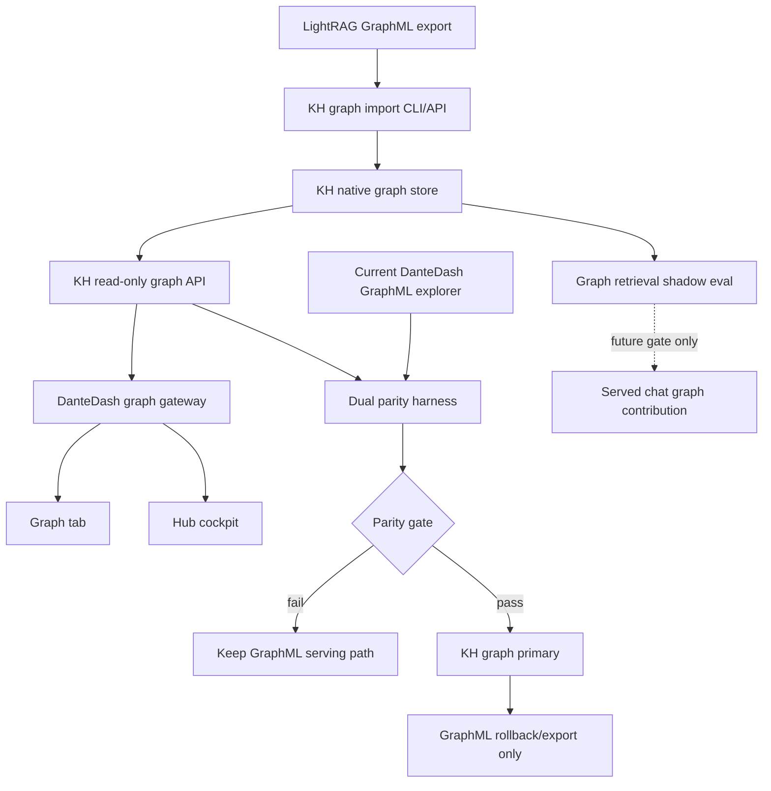
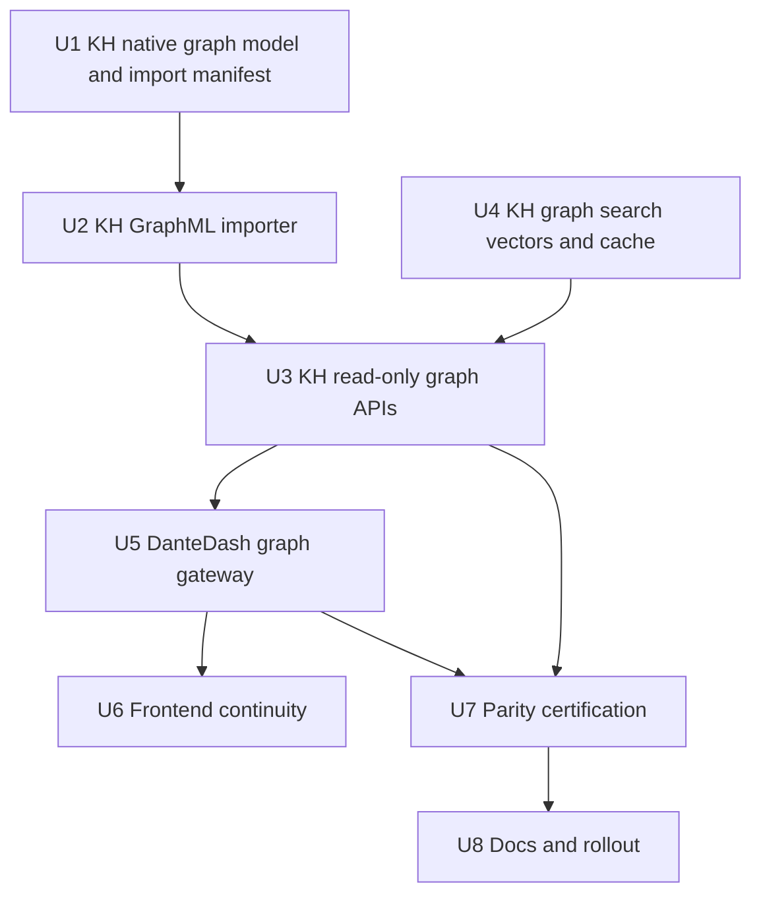
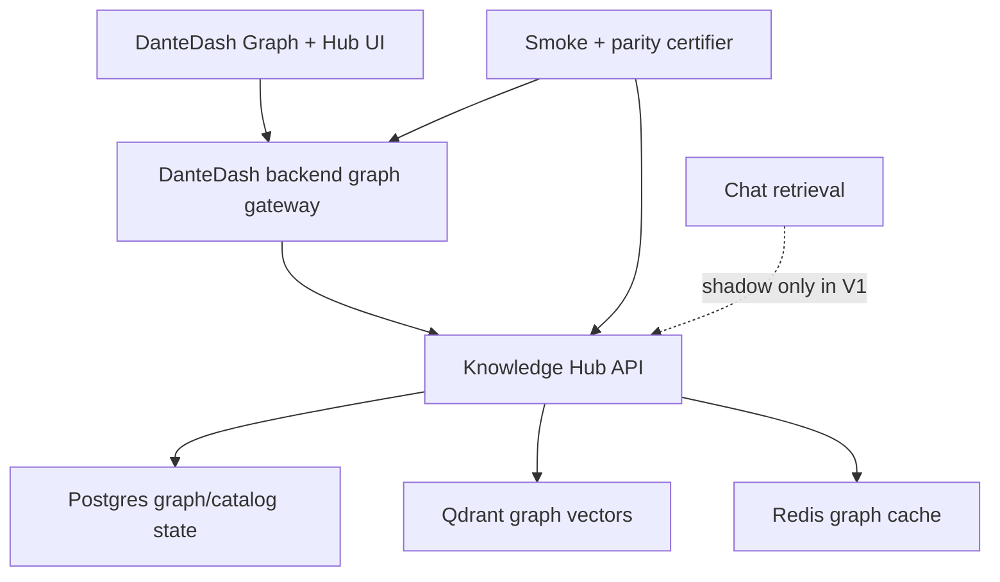

# feat: Knowledge Hub Native LightRAG Graph Sunset

## Summary

Promote the current LightRAG GraphML relationship map into a Knowledge Hub
native graph surface backed by the official local stack, while keeping DanteDash
as the visual cockpit that consumes a stable read-only graph API.

The first implementation should import and serve the existing graph semantics
from Knowledge Hub, prove parity against the current DanteDash GraphML explorer,
then cut DanteDash over by flag. Served chat and retrieval should remain
shadow-only for graph contributions until a separate quality gate proves that
graph retrieval improves answers.

---

## Problem Frame

DanteDash already uses Knowledge Hub as the primary KB backend for visual
packages, search, previews, library, and chat sources, but the Graph tab still
depends on a local LightRAG GraphML file. That file is valuable, but it is a
single exported artifact outside the official Knowledge Hub runtime and cannot
be the long-term canonical graph store.

Knowledge Hub already has the correct runtime boundary: Postgres for cataloged
state, Qdrant for retrieval vectors, Redis for cache/ephemeral state, and API
access through the hub service rather than direct datastore access. The graph
lane also already exists as staged infrastructure, but current graph extraction
manifests are explicitly not a served store. This plan turns the existing graph
into a native KH-owned graph surface without prematurely promoting GraphRAG into
chat answers.

---

## Target Repos

- **DanteDash repo:** this plan lives here and covers the app, backend graph
  gateway, frontend Graph tab, Hub panel, smoke, and docs.
- **Knowledge Hub repo:** implementation work should happen in a clean KH
  worktree. The currently checked primary KH worktree was observed with many
  unrelated dirty changes, so implementation should not be based directly on
  that dirty checkout.

All paths below are repo-relative within the repo named in each file list.

---

## Assumptions

*This plan was authored without synchronous user confirmation. The items below
are agent inferences that should be reviewed before implementation proceeds.*

- V1 targets Graph tab and Hub cockpit parity first. Graph-enhanced chat
  retrieval remains shadow-only until a later eval gate.
- The existing GraphML payload is the source of truth for the initial native KH
  graph import. V1 imports it; it does not regenerate a new graph from scratch.
- GraphML remains an export/rollback artifact during the cutover window. The
  plan sunsets GraphML as canonical serving state, not as a backup format.
- A new graph database is not needed for V1. Use KH's official local stack and
  service boundary instead of adding Neo4j or another runtime.
- Knowledge Hub should own graph ingestion, graph storage, graph API, and graph
  retrieval shadow evaluation. DanteDash should own presentation, parity
  certification, and user-facing fallback behavior.

---

## Requirements

- R1. Preserve current DanteDash Graph View behavior: health, summary, search,
  subgraph, node detail, entity/route filters, top nodes, inspector content,
  prepared queries, and optional visual renderer lifecycle.
- R2. Import the current LightRAG GraphML into a KH-native graph store without
  mutating the source GraphML, vault, visual packages, or served retrieval
  defaults.
- R3. Preserve graph semantics and provenance: node ids, labels, entity types,
  descriptions, source ids, source files, source families, route ids, route
  labels, edge weights, edge descriptions, keywords, degree, and weighted
  degree.
- R4. Expose bounded read-only KH graph APIs equivalent to the existing
  DanteDash graph DTOs, with public-safe errors and no local absolute path,
  token, DSN, runtime root, or raw trace leakage.
- R5. Add a dual-read parity harness that compares current GraphML output and
  KH-native graph output across health, counts, search, subgraph, node detail,
  filters, and sanitized source hints before cutover.
- R6. Cut DanteDash graph reads over by explicit backend mode/flag, with
  rollback to GraphML until the parity gate passes and a rollback window ends.
- R7. Keep agents and DanteDash away from direct Postgres, Qdrant, and Redis
  access. All graph reads and imports go through KH APIs or KH-owned CLIs.
- R8. Keep graph retrieval contributions out of served chat answers in V1.
  Graph retrieval may run in shadow evals, reports, and internal diagnostics
  only.
- R9. Maintain current KB visual package behavior. This graph migration must not
  regress KH-native visual search, image-query search, previews, source cards,
  context sources, or counts.
- R10. Provide tests and smokes that prove native graph parity, safety, degraded
  behavior, fallback behavior, and frontend continuity.

---

## Scope Boundaries

- Do not delete the source GraphML in this plan.
- Do not make GraphML disappear as a rollback/export artifact during V1.
- Do not use a new graph database or require a new always-on runtime.
- Do not expose mutating graph controls in DanteDash UI.
- Do not merge LightRAG graph retrieval into chat answers as a served source in
  this plan.
- Do not mutate Obsidian vault files, visual package sidecars, source media,
  provider auth, or unrelated Knowledge Hub data.
- Do not let the frontend call Postgres, Qdrant, Redis, or Knowledge Hub
  datastores directly.
- Do not import raw GraphML paths, runtime roots, or local filesystem details
  into public frontend payloads.

### Deferred to Follow-Up Work

- Served GraphRAG/chat integration after graph shadow eval shows answer-quality
  improvement with no citation or no-leak regressions.
- Regenerating a fresh graph from KH canonical documents rather than importing
  the existing LightRAG GraphML.
- Graph curation/editing tools, merge/split workflows, and operator mutation UI.
- GraphML export from KH-native graph after KH becomes canonical.
- MCP graph tools for agents if the HTTP graph APIs prove insufficient.

---

## Context & Research

### Relevant DanteDash Code and Patterns

- `backend/app/graph_explorer.py`: current isolated read-only GraphML parser,
  cache, DTO helper, sanitization, route labeling, source-family inference, and
  prepared-query generation.
- `backend/app/routes/graph.py`: current `/api/graph/*` route contract with
  bounded query params, Pydantic DTOs, and redacted error handling.
- `frontend/src/lib/api.ts`: current graph wire types and client methods.
- `frontend/src/hooks/useGraph.ts`: current graph data-loading hook.
- `frontend/src/components/GraphPanel.tsx`: current graph workspace, filters,
  focus mode, selected node state, and inspector behavior.
- `frontend/src/components/GraphCanvas.tsx`: current optional Sigma renderer
  and layout resize/refresh behavior.
- `frontend/src/components/KnowledgeHubPanel.tsx`: Hub cockpit pattern for
  showing KH-related status without owning KH runtime mutation.
- `backend/app/knowledge_hub_client.py`: existing server-side client wrapper
  for KH APIs and sanitization.
- `backend/app/kb_gateway.py`: existing backend mode/fallback pattern for
  Chroma/KH cutover that the graph cutover should mirror.
- `scripts/smoke-dante-dashboard.sh`: existing smoke boundary for KB status,
  graph health, KH health, and strict/warn behavior.
- `docs/runbooks/dante-dashboard-operations.md`: operator-facing documentation
  for KB mode, Graph View, smoke, and rollback posture.

### Relevant Knowledge Hub Code and Patterns

- `src/knowledge_hub/graph_extraction.py`: current graph extraction manifest
  lane, graph consolidation helper, and graph retrieval shadow eval. It is
  explicitly staged and not currently a served store.
- `src/knowledge_hub/main.py`: existing API registration surface.
- `src/knowledge_hub/hub_service.py`: existing service boundary for KH-owned
  retrieval and DanteDash package APIs.
- `src/knowledge_hub/runtime.py`: runtime helpers and collection naming
  patterns for datastore-backed retrieval.
- `src/knowledge_hub/config.py`: settings pattern for optional features,
  datastore URLs, collection names, and safety flags.
- `src/knowledge_hub/mcp_server.py`: topology and memory-plane descriptions
  showing Postgres, Qdrant, Redis, and visual memory as official surfaces.
- `tests/test_framework_shadow_lightrag.py`: current expectation that graph
  work stays shadow-only unless explicitly promoted.
- `tests/test_framework_canary_plan.py`: current guardrails for no graph
  promotion writes and no Qdrant mutation in shadow readiness paths.

### Live Evidence Collected During Planning

- DanteDash KB status reports `mode=knowledge_hub`,
  `primary_backend=knowledge_hub`, `chroma_fallback_enabled=false`,
  `chroma_available_as_fallback=false`, and all KB surfaces, including
  `image_query_search`, routed through Knowledge Hub.
- Knowledge Hub health is available with profile `remote_full_power`.
- KH DanteDash package stats report `8099` total package rows:
  `4187` text, `2231` image, and `1681` video.
- DanteDash Graph health reports a local `graph_chunk_entity_relation.graphml`
  source, `read_only=true`, `loaded=false` before summary load, and a stable
  metadata hash.
- A bounded graph summary load reports `23962` nodes and `50666` edges from the
  current GraphML source.

### Institutional Learnings

- KH migration work should be parity-first, manifested, reversible, and
  operator-gated.
- Chroma visual sunset already moved DanteDash KB reads into KH-native mode;
  this plan should follow that gateway/fallback style instead of inventing a
  second cutover mechanism.
- Existing graph work in KH has repeatedly been treated as shadow-only until
  canary evidence proves served reliability. Preserve that boundary.

### External References

- None. This plan is grounded in local repository code, local runbooks, and live
  endpoint evidence.

---

## Key Technical Decisions

| Decision | Rationale |
|---|---|
| Import GraphML into KH-native graph first | Preserves the useful existing graph while moving canonical serving ownership into KH. |
| Keep graph serving read-only in V1 | Matches DanteDash Graph View and avoids accidental graph/vault/runtime mutation. |
| Use KH APIs and CLIs, not direct datastore calls from DanteDash | Preserves the official Knowledge Hub boundary and keeps credentials/runtime roots server-side. |
| Store canonical graph state in KH's official local stack | Avoids a new graph database and keeps graph state governed by KH lifecycle, backup, smoke, and topology. |
| Mirror current DanteDash graph DTOs for V1 | Lets the UI cut over without a product redesign and makes parity measurable. |
| Keep graph retrieval shadow-only | Prevents a graph migration from silently changing chat answers before quality evidence exists. |
| Use dual-read parity before cutover | Prevents losing route labels, source hints, node detail, or graph search behavior during the migration. |

---

## Open Questions

### Resolved During Planning

- Should the full LightRAG graph become native in KH? Yes. The selected approach
  is the recommended Graph native path.
- Should V1 rebuild the graph from KH documents? No. V1 imports the existing
  graph first to preserve behavior and make parity measurable.
- Should graph retrieval feed chat immediately? No. It stays shadow-only until a
  separate quality gate.
- Should DanteDash own graph storage? No. DanteDash remains the visual cockpit;
  KH owns storage and retrieval services.

### Deferred to Implementation

- Exact KH graph table/collection names: implementation should follow the
  active KH naming conventions after reviewing current datastore helpers.
- Exact import manifest schema: implementation should version it and preserve
  enough source metadata for idempotency, rollback, and parity debugging.
- Exact graph embedding strategy for Qdrant: V1 can serve structural graph APIs
  without semantic graph vectors; semantic entity/relation vectors should be
  added only when needed for search parity or shadow retrieval eval.
- Exact parity threshold tuning: initial thresholds are proposed below, but the
  implementation may tighten or stratify them after the first baseline report.

---

## High-Level Technical Design

> This illustrates the intended approach and is directional guidance for review,
> not implementation specification. The implementing agent should treat it as
> context, not code to reproduce.

### Proposed Graph Runtime Modes

| Mode | DanteDash graph reads | KH graph requirement | Intended use |
|---|---|---|---|
| `graphml` | Existing local GraphML explorer | None | Rollback and current baseline. |
| `dual` | GraphML primary plus KH shadow comparison | KH native graph available | Parity measurement and canary period. |
| `knowledge_hub` | KH native graph primary | KH graph API passes parity | Default after cutover. |

### Proposed Feature Flags

- `DANTEDASH_GRAPH_BACKEND=graphml|dual|knowledge_hub`
- `DANTEDASH_GRAPH_KH_FALLBACK_ENABLED=true|false`
- `DANTEDASH_GRAPH_PARITY_STRICT=false|true`
- `KNOWLEDGE_HUB_GRAPH_NATIVE_ENABLED=false|true`
- `KNOWLEDGE_HUB_GRAPH_IMPORT_ENABLED=false|true`
- `KNOWLEDGE_HUB_GRAPH_RETRIEVAL_SHADOW_ENABLED=false|true`

---

## Implementation Units

### U1. KH Native Graph Domain And Import Contract

**Goal:** Define the KH-native representation for imported graph nodes, edges,
provenance, source metadata, import manifests, and graph versions.

**Requirements:** R2, R3, R4, R7

**Dependencies:** None

**Files:**
- Create in Knowledge Hub repo: `src/knowledge_hub/graph_native.py`
- Modify in Knowledge Hub repo: `src/knowledge_hub/config.py`
- Test in Knowledge Hub repo: `tests/test_graph_native.py`

**Approach:**
- Add a small graph-native domain module that owns graph version identity,
  source snapshot metadata, import run metadata, node records, edge records,
  provenance records, and public-safe DTO shaping.
- Model import idempotency around source metadata hash plus graph version id.
- Preserve route/source semantics from the current DanteDash explorer rather
  than reducing the graph to only node ids and adjacency.
- Store public-safe source facts separately from private operator source facts
  so API payloads can never leak local filesystem roots.
- Keep the module datastore-agnostic at the interface boundary, but design it to
  be backed by KH's official persistence helpers rather than a file-only
  manifest.

**Execution note:** Start with characterization tests using a tiny graph fixture
that includes route labels, source files, duplicate labels, slashes in node ids,
and weighted edges.

**Patterns to follow:**
- `src/knowledge_hub/graph_extraction.py` for graph schema versioning,
  manifest/version vocabulary, and shadow-only safety posture.
- `src/knowledge_hub/hub_service.py` for service-owned public DTO shaping.
- `src/knowledge_hub/runtime.py` for runtime hashing and stable identity
  helpers.

**Test scenarios:**
- Happy path: a tiny imported graph becomes a versioned graph snapshot with
  stable node and edge ids.
- Happy path: route labels, source families, source ids, and source files are
  preserved in normalized graph records.
- Edge case: node ids containing slashes, punctuation, mixed case, and Unicode
  remain addressable without accidental path traversal semantics.
- Edge case: repeated labels with distinct ids remain distinct.
- Error path: source metadata containing local absolute paths is retained only
  in private/import metadata and is excluded from public DTOs.
- Error path: malformed or missing required graph fields produce a failed import
  row, not a partially public graph snapshot.

**Verification:**
- KH has a tested graph-native domain contract that can represent the current
  DanteDash GraphML semantics without exposing private path data.

---

### U2. KH GraphML Importer

**Goal:** Add a KH-owned importer that reads the existing LightRAG GraphML
artifact, converts it to the native graph domain, writes an import manifest, and
can run in dry-run or execute mode.

**Requirements:** R2, R3, R7, R8

**Dependencies:** U1

**Files:**
- Create in Knowledge Hub repo: `src/knowledge_hub/graph_import.py`
- Modify in Knowledge Hub repo: `src/knowledge_hub/cli.py`
- Modify in Knowledge Hub repo: `src/knowledge_hub/main.py`
- Test in Knowledge Hub repo: `tests/test_graph_import.py`

**Approach:**
- Implement a bounded, XML-safe GraphML reader with the same safety posture as
  DanteDash's current parser: reject unsafe declarations, enforce source byte
  caps, node caps, edge caps, field caps, string caps, and list caps.
- Treat GraphML as an external input. Do not write back to it and do not derive
  public API paths from its local source path.
- Produce two artifacts: a public import summary and a private operator
  manifest. Public summaries should report counts, version ids, hash digests,
  and public-safe failures; private manifests can retain operator source
  details if they remain outside public/static/frontend payloads.
- Support `dry_run` and `execute` so parity can inspect the graph shape before
  KH persistence changes.
- Make the import idempotent. Re-running the same source hash should not create
  duplicate native graph versions unless explicitly requested.

**Patterns to follow:**
- `src/knowledge_hub/graph_extraction.py` for dry-run/write split and graph
  manifest conventions.
- `src/knowledge_hub/visual_memory.py` and `src/knowledge_hub/hub_service.py`
  for KH-owned import/search service boundaries.
- DanteDash `backend/app/graph_explorer.py` for safety limits and GraphML field
  normalization behavior, adapted into KH rather than imported as app code.

**Test scenarios:**
- Happy path: dry-run parses a small GraphML fixture and reports expected
  counts without writing native graph state.
- Happy path: execute imports the fixture, writes one graph version, and records
  an import manifest with counts and source hash.
- Happy path: re-running execute with the same source hash is idempotent.
- Edge case: GraphML with slashed node ids imports and remains addressable.
- Edge case: missing optional descriptions or keywords become empty public
  fields, not crashes.
- Error path: unsafe XML declaration, oversized file, too many nodes, too many
  edges, or overlong fields fail with a redacted error.
- Error path: partial import failure leaves the previously active graph version
  active and reports the failed import as non-promoted.
- Integration: imported graph counts match the fixture baseline and are
  retrievable through the domain service from U1.

**Verification:**
- KH can import the LightRAG graph into native state through a KH-owned,
  operator-gated path without mutating the source GraphML or served chat
  behavior.

---

### U3. KH Read-Only Graph APIs

**Goal:** Expose KH-native read-only graph APIs that match the current
DanteDash Graph View contract closely enough for dual-read parity and frontend
cutover.

**Requirements:** R1, R3, R4, R7, R8

**Dependencies:** U1, U2

**Files:**
- Create in Knowledge Hub repo: `src/knowledge_hub/graph_api.py`
- Modify in Knowledge Hub repo: `src/knowledge_hub/main.py`
- Modify in Knowledge Hub repo: `src/knowledge_hub/hub_service.py`
- Test in Knowledge Hub repo: `tests/test_graph_api.py`
- Test in Knowledge Hub repo: `tests/test_api_v1.py`

**Approach:**
- Add read endpoints for graph health, summary, search, subgraph, and node
  detail. The endpoint names should follow KH API conventions, but payloads
  should retain the current DanteDash graph semantics.
- Keep all payloads bounded by request caps and service caps. Never return the
  full graph.
- Return stable public fields: graph version, dataset id, source name/hash,
  loaded/indexed status, node/edge counts, route counts, entity type counts,
  source family counts, graph cards, visual nodes, visual edges, and public-safe
  prepared queries.
- Handle missing native graph as a public `unavailable` state rather than a
  backend traceback.
- Preserve a clean separation between structural APIs for the UI and retrieval
  shadow APIs for later eval.

**Patterns to follow:**
- DanteDash `backend/app/routes/graph.py` for DTO shape and query caps.
- Knowledge Hub `src/knowledge_hub/main.py` for API registration and error
  response style.
- Knowledge Hub `src/knowledge_hub/hub_service.py` for service-layer payload
  shaping.

**Test scenarios:**
- Happy path: graph health reports native graph availability, version id,
  public source metadata, read-only state, and counts.
- Happy path: summary returns top nodes, counts, and a bounded visual graph
  payload.
- Happy path: search returns relevant node cards with score/snippet fields and
  honors limit, entity type, and route filters.
- Happy path: subgraph returns a bounded neighborhood around a selected node.
- Happy path: node detail returns descriptions, adjacent edges, prepared
  queries, and source hints.
- Edge case: node ids containing slashes are retrievable without route
  ambiguity.
- Edge case: empty search or no-match search returns an empty result set with
  `ok=true`.
- Error path: no active native graph returns a public unavailable response, not
  a 500 with internal traces.
- Error path: oversized query params are rejected or clamped according to KH API
  conventions.
- Security: public payloads contain no local absolute paths, DSNs, tokens,
  runtime roots, or raw stack traces.

**Verification:**
- KH can serve the graph surfaces that DanteDash needs without reading the
  GraphML on every request and without making graph retrieval a served chat
  feature.

---

### U4. KH Graph Search Vectors And Cache

**Goal:** Add optional KH-owned semantic graph search and cache support for
large graph payloads without making semantic graph retrieval part of served
chat.

**Requirements:** R1, R4, R7, R8, R10

**Dependencies:** U1, U2, U3

**Files:**
- Modify in Knowledge Hub repo: `src/knowledge_hub/runtime.py`
- Modify in Knowledge Hub repo: `src/knowledge_hub/graph_native.py`
- Modify in Knowledge Hub repo: `src/knowledge_hub/graph_extraction.py`
- Test in Knowledge Hub repo: `tests/test_graph_native.py`
- Test in Knowledge Hub repo: `tests/test_graph_retrieval_shadow.py`

**Approach:**
- Keep structural search available even without Qdrant graph vectors.
- If semantic graph vectors are added, write them as graph-specific entity and
  relation points in KH-managed collections, with graph version metadata and no
  coupling to DanteDash internals.
- Cache expensive summary/subgraph payloads in Redis only as derived state that
  can be rebuilt from native graph records.
- Keep graph retrieval shadow eval pointed at the native graph lane instead of
  the legacy LightRAG fallback when a native graph is available.
- Never promote graph retrieval into served chat inside this unit.

**Patterns to follow:**
- `src/knowledge_hub/graph_extraction.py` for `run_graph_retrieval_shadow_eval`.
- `src/knowledge_hub/runtime.py` for collection naming and runtime helpers.
- Current KH visual runtime pattern for Qdrant point metadata and collection
  isolation.

**Test scenarios:**
- Happy path: structural graph search works when semantic graph vectors are not
  configured.
- Happy path: graph vector indexing writes graph-version-tagged points when
  explicitly enabled.
- Happy path: cached subgraph payloads are reused for identical graph version
  and request shape.
- Edge case: a new graph version invalidates or bypasses older cached payloads.
- Error path: Qdrant unavailable degrades semantic graph search while
  structural graph APIs stay available.
- Error path: Redis unavailable disables cache but does not break graph reads.
- Safety: shadow eval reports graph lane metrics without changing served
  retrieval defaults.

**Verification:**
- KH can support graph search performance and shadow retrieval measurement while
  keeping the native graph read API independent and safe.

---

### U5. DanteDash Graph Gateway And Dual-Read Parity

**Goal:** Add a DanteDash graph backend adapter that can read from GraphML, KH,
or dual mode while preserving current `/api/graph/*` contracts.

**Requirements:** R1, R4, R5, R6, R9, R10

**Dependencies:** U3

**Files:**
- Modify in DanteDash repo: `backend/app/deps.py`
- Modify in DanteDash repo: `backend/app/knowledge_hub_client.py`
- Modify in DanteDash repo: `backend/app/routes/graph.py`
- Modify in DanteDash repo: `backend/app/graph_explorer.py`
- Create in DanteDash repo: `backend/app/graph_gateway.py`
- Test in DanteDash repo: `backend/tests/test_graph_gateway.py`
- Test in DanteDash repo: `backend/tests/test_graph_routes.py`
- Test in DanteDash repo: `backend/tests/test_knowledge_hub_client.py`

**Approach:**
- Keep the current GraphML explorer as one backend implementation.
- Add a KH graph backend implementation that proxies only read-only graph APIs
  through `KnowledgeHubClient`.
- Add a graph gateway similar in spirit to `kb_gateway.py` with modes:
  `graphml`, `dual`, and `knowledge_hub`.
- In dual mode, serve GraphML primary and record/return safe backend diagnostics
  for KH parity without changing frontend behavior.
- In KH mode, serve KH primary and optionally fall back to GraphML only when the
  explicit graph fallback flag is enabled.
- Keep route response models stable so the frontend does not need to branch on
  backend mode.

**Execution note:** Add route/gateway tests before changing the default graph
  source. The existing GraphML tests should remain green.

**Patterns to follow:**
- `backend/app/kb_gateway.py` for mode/fallback semantics.
- `backend/app/knowledge_hub_client.py` for server-side KH calls and sanitized
  public payloads.
- `backend/app/routes/graph.py` for existing route contracts and query caps.

**Test scenarios:**
- Happy path: `graphml` mode returns current route payloads unchanged.
- Happy path: `knowledge_hub` mode returns KH graph payloads through the same
  `/api/graph/*` response models.
- Happy path: `dual` mode serves GraphML payloads while recording KH comparison
  diagnostics without leaking internal KH errors.
- Edge case: missing KH native graph in `knowledge_hub` mode returns a clear
  graph unavailable response.
- Error path: KH timeout in `knowledge_hub` mode uses GraphML fallback only when
  fallback is explicitly enabled.
- Error path: KH malformed payload becomes a sanitized unavailable state.
- Security: no response includes KH base URL, bearer token, DSN, local absolute
  path, or raw backend traceback.
- Integration: `/api/graph/health`, `/summary`, `/search`, `/subgraph`, and
  `/node/{node_id}` work in all graph modes.

**Verification:**
- DanteDash can switch graph serving source without frontend contract changes,
  and GraphML remains a controlled rollback path during cutover.

---

### U6. Frontend Graph And Hub Continuity

**Goal:** Keep the DanteDash Graph tab and Hub cockpit coherent while graph
serving moves from local GraphML to KH-native graph APIs.

**Requirements:** R1, R4, R6, R9, R10

**Dependencies:** U5

**Files:**
- Modify in DanteDash repo: `frontend/src/lib/api.ts`
- Modify in DanteDash repo: `frontend/src/hooks/useGraph.ts`
- Modify in DanteDash repo: `frontend/src/components/GraphPanel.tsx`
- Modify in DanteDash repo: `frontend/src/components/KnowledgeHubPanel.tsx`
- Modify in DanteDash repo: `frontend/src/index.css`

**Approach:**
- Preserve existing Graph tab UX: focus mode, graph search, filters, top nodes,
  selected-node inspector, pause/show visual behavior, and renderer cleanup.
- Add backend source/status affordances only where useful to operators:
  GraphML baseline, dual, KH native, fallback active, or unavailable.
- Avoid exposing implementation paths or datastore names in regular user copy.
  Use concise labels such as `Graph native`, `Graph fallback`, and `Graph
  unavailable`.
- In Hub, show KH graph as a first-class memory plane only when KH reports an
  active native graph; otherwise show it as unavailable/staged.
- Do not redesign the graph product during this migration. UI changes should
  support source clarity and error states, not create a new graph workflow.

**Patterns to follow:**
- `frontend/src/components/GraphPanel.tsx` current focus mode and inspector
  state preservation.
- `frontend/src/components/KnowledgeHubPanel.tsx` current status-card pattern.
- `frontend/src/lib/api.ts` current normalized API typing.

**Test scenarios:**
- Happy path: Graph tab renders KH-native graph data with the same controls as
  GraphML mode.
- Happy path: focus mode still hides side rails and resizes the canvas after
  graph source cutover.
- Happy path: selecting a node preserves inspector state while the visual
  renderer is paused or active.
- Edge case: graph source unavailable shows a readable empty/error state and
  does not break Search, Chat, Library, or Hub tabs.
- Edge case: long graph labels and route labels do not overflow controls or
  cards at practical desktop widths.
- Integration: Hub shows graph native status separately from visual KB package
  status and KH health.
- Regression: no frontend payload renders local absolute paths or backend
  traces.

**Verification:**
- The UI behaves like the existing Graph View while the backend source changes,
  and operators can tell whether the graph is KH-native or on fallback.

---

### U7. Parity Certification, Smoke, And Cutover Gate

**Goal:** Add repeatable certification that proves KH-native graph parity before
switching DanteDash default graph reads away from GraphML.

**Requirements:** R1, R3, R5, R6, R8, R9, R10

**Dependencies:** U3, U5, U6

**Files:**
- Create in DanteDash repo: `scripts/dantedash_kh_graph_parity_certify.py`
- Modify in DanteDash repo: `scripts/smoke-dante-dashboard.sh`
- Create in DanteDash repo: `backend/tests/test_graph_parity.py`
- Test in Knowledge Hub repo: `tests/test_graph_api.py`
- Test in Knowledge Hub repo: `tests/test_graph_import.py`

**Approach:**
- Build a graph parity suite that samples fixed baseline queries and structural
  checks against both GraphML and KH graph backends.
- Compare counts, top route/entity/source-family counts, top weighted nodes,
  query result overlap, subgraph node/edge overlap, node detail fields, and
  source-hint sanitization.
- Include stratified query examples across current dominant graph routes:
  visual analysis cards, source routing, craft field manuals, treatment/PPM,
  AI filmmaking, QC/repair, visual reference assets, and tools/pipelines.
- Use a strict score gate before default cutover. Proposed initial gate:
  overall graph parity score `>= 0.95`, no P0 safety failures, no missing node
  detail for sampled nodes, and zero public path/secret leaks.
- Add warn-only smoke when KH graph is unavailable unless strict graph mode is
  enabled.
- Add strict smoke that fails when expected mode is KH-native and KH graph is
  missing or below parity.

**Patterns to follow:**
- `scripts/dantedash_kh_cutover_certify.py` for current KH/Chroma certification
  report style.
- `scripts/smoke-dante-dashboard.sh` for strict/warn smoke gates.
- `backend/app/kb_parity.py` for score/report structure.

**Test scenarios:**
- Happy path: parity certification passes when fixture GraphML and fixture KH
  graph return equivalent payloads.
- Happy path: strict smoke passes with KH graph primary and no GraphML fallback.
- Edge case: result ordering differs but top-k overlap remains above threshold;
  report should mark this as acceptable drift, not a hard fail.
- Error path: node count drift, missing route labels, missing source files, or
  missing node detail drops the score and blocks cutover.
- Error path: any path/secret leak is a hard fail independent of overall score.
- Error path: KH graph unavailable in non-strict smoke is warn-only; in strict
  smoke it fails clearly.
- Regression: visual KB smoke remains green while graph parity runs.

**Verification:**
- A written parity report proves whether KH-native graph is eligible to become
  the default DanteDash graph source.

---

### U8. Documentation, Rollout, And Rollback

**Goal:** Update operator docs so the team can understand the native graph
state, run the importer/certifier safely, cut over, and roll back.

**Requirements:** R5, R6, R7, R8, R9, R10

**Dependencies:** U7

**Files:**
- Modify in DanteDash repo: `docs/runbooks/dante-dashboard-operations.md`
- Modify in DanteDash repo: `README.md`
- Create in DanteDash repo: `docs/reports/knowledge-hub-graph-cutover-certification.md`
- Modify in Knowledge Hub repo: `README.md`
- Modify in Knowledge Hub repo: `docs/reports/2026-06-02-p2-canary-handoff.md`
- Create in Knowledge Hub repo: `docs/reports/dantedash-native-graph-import.md`

**Approach:**
- Document that KH owns the native graph surface after cutover, while DanteDash
  remains the local visual cockpit.
- Document graph modes and flags, including when to use GraphML rollback.
- Document that graph retrieval remains shadow-only for chat in V1.
- Record the import manifest path, parity report path, graph version id, source
  hash, node/edge counts, score, and cutover decision.
- Update stale language that describes graph as only missing/staged after the
  native graph import has passed.
- Keep docs precise about what was not done: no GraphML deletion, no GraphRAG
  served promotion, no direct datastore access from agents, no vault mutation.

**Patterns to follow:**
- `docs/runbooks/dante-dashboard-operations.md` current operator style.
- `docs/reports/knowledge-hub-cutover-certification.md` current KH cutover
  report style.
- KH graph readiness docs that distinguish staged graph evidence from served
  promotion.

**Test scenarios:**
- Test expectation: none for docs-only content, but reviewers should confirm
  commands, flags, report names, and rollback instructions match implemented
  behavior.

**Verification:**
- Operators can read one runbook and know current graph owner, mode, health
  checks, parity gates, rollback flags, and what remains deferred.

---

## System-Wide Impact

- **Interaction graph:** KH gains native graph import and read APIs; DanteDash
  graph routes gain a gateway layer; frontend Graph/Hub consume the same public
  `/api/graph/*` shape.
- **Error propagation:** KH graph import/API failures become public-safe
  unavailable states in DanteDash. Fallback to GraphML is allowed only by
  explicit graph fallback flag.
- **State lifecycle risks:** Partial imports must not promote a bad graph
  version. Cache entries must be graph-version-scoped. Old GraphML remains
  rollback/export during the cutover window.
- **API surface parity:** Existing DanteDash graph endpoints should remain
  stable. KH adds native graph APIs but does not expose raw datastore details.
- **Integration coverage:** Unit tests alone are insufficient; parity
  certification must compare real representative GraphML and KH payloads.
- **Unchanged invariants:** Visual package search, image-query search, preview,
  chat sources, source cards, and source counts remain KH-native and should not
  regress. Graph retrieval does not enter served chat in V1.

---

## Risks & Dependencies

| Risk | Likelihood | Impact | Mitigation |
|---|---:|---:|---|
| Graph semantics are lost during import | Medium | High | Preserve fields explicitly, use fixture coverage, and block cutover on parity failures. |
| Native schema overfits the current GraphML quirks | Medium | Medium | Version import manifests and keep graph domain flexible enough for future regenerated graphs. |
| Large graph payloads degrade KH or UI performance | Medium | High | Keep strict caps, bounded APIs, optional Redis cache, and no full-graph browser payloads. |
| Public payload leaks local paths from source files or GraphML metadata | Medium | High | Add sanitizer tests and make any leak a hard parity failure. |
| KH primary graph becomes unavailable after cutover | Medium | Medium | Keep GraphML fallback flag through rollback window and surface clear graph status. |
| Graph retrieval accidentally changes chat answers | Low | High | Keep retrieval graph lane shadow-only and test that served chat does not consume graph hits. |
| Work happens in dirty KH checkout and mixes unrelated changes | High | Medium | Require a clean KH worktree or selective branch before implementation. |
| Existing Chroma sunset work is confused with graph sunset | Medium | Medium | Treat KB package migration and graph migration as separate surfaces with separate flags and reports. |

---

## Success Metrics

- KH-native graph import reports the same baseline graph counts as the current
  GraphML explorer: `23962` nodes and `50666` edges, or documents every
  accepted exclusion.
- Graph parity certification score is `>= 0.95`.
- Sampled search queries across major graph routes meet the configured top-k
  overlap threshold.
- Sampled node detail payloads preserve descriptions, source files, source ids,
  prepared queries, degree, weighted degree, route labels, and adjacent edges.
- No public API or frontend payload leaks local absolute paths, DSNs, tokens,
  runtime roots, or raw traces.
- DanteDash smoke passes with `DANTEDASH_GRAPH_BACKEND=knowledge_hub` and
  GraphML fallback disabled.
- Visual KB smoke remains green: KB mode stays KH-native, source cards and
  previews continue to work, and Graph changes do not regress chat/search.

---

## Dependencies / Prerequisites

- A clean Knowledge Hub implementation worktree.
- A readable current LightRAG GraphML source for initial import and baseline
  parity.
- Local KH runtime available with Postgres, Qdrant, and Redis.
- Current DanteDash KB cutover state remains KH-native and healthy while graph
  work proceeds.
- Any existing KH DanteDash package-search PRs that define public-safe payload
  conventions should be merged or consciously rebased before graph work builds
  on them.

---

## Phased Delivery

### Phase 1. Native Graph Import, Read API, And Local Fixture Parity

- Land U1 through U3 in Knowledge Hub with fixture tests and no DanteDash
  default cutover.
- Prove KH can import a small graph fixture and serve bounded graph APIs.

### Phase 2. Real Graph Import And Dual DanteDash Parity

- Run the importer on the current LightRAG GraphML with an import manifest.
- Land U5 and U7 in DanteDash so `/api/graph/*` can run in dual mode and
  produce a parity report.

### Phase 3. Frontend Source Clarity And Operator Smoke

- Land U6 and U8 so Graph/Hub status reflects native graph availability and
  operators can use the new graph modes safely.

### Phase 4. KH-Native Graph Cutover

- Switch DanteDash graph default to KH-native only after parity score and smoke
  gates pass.
- Keep GraphML fallback during a rollback window.
- After the rollback window, leave GraphML as export/backup, not the serving
  source.

---

## Documentation / Operational Notes

- The docs must distinguish three separate surfaces: KH visual packages,
  KH-native graph, and graph retrieval shadow eval.
- The current `/api/kb/status` KH-native state does not imply graph sunset is
  complete. Add graph-specific status so operators can see the difference.
- Smoke should remain warn-only for graph when the app is not configured to
  require KH-native graph, and strict when cutover certification is being run.
- Rollback should be a flag change back to GraphML serving, not a datastore
  restore.
- Do not remove old GraphML docs until the rollback window ends and native KH
  graph reports are committed.

---

## Sources & References

- Related DanteDash plan: `docs/plans/2026-06-16-006-feat-black-label-graph-view-plan.md`
- Related DanteDash plan: `docs/plans/2026-06-19-001-feat-knowledge-hub-parity-chroma-sunset-plan.md`
- Related DanteDash plan: `docs/plans/2026-06-20-001-feat-kh-native-image-query-chroma-read-disable-plan.md`
- Related DanteDash code: `backend/app/graph_explorer.py`
- Related DanteDash code: `backend/app/routes/graph.py`
- Related DanteDash code: `backend/app/kb_gateway.py`
- Related DanteDash code: `backend/app/knowledge_hub_client.py`
- Related DanteDash code: `frontend/src/components/GraphPanel.tsx`
- Related DanteDash code: `frontend/src/components/KnowledgeHubPanel.tsx`
- Related Knowledge Hub code: `src/knowledge_hub/graph_extraction.py`
- Related Knowledge Hub code: `src/knowledge_hub/hub_service.py`
- Related Knowledge Hub code: `src/knowledge_hub/runtime.py`
- Related Knowledge Hub code: `src/knowledge_hub/main.py`
