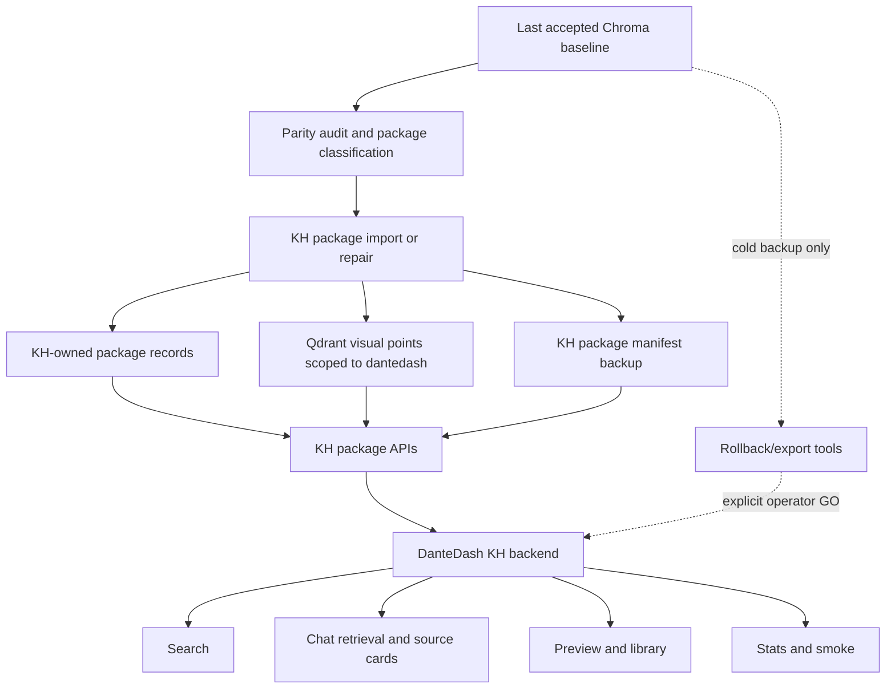

# feat: KH-Native Total Chroma Sunset

## Summary

Move DanteDash to a strict Knowledge Hub-native runtime where normal search, chat retrieval, context sources, previews, library, stats, image-query, and smoke checks do not read, initialize, or require Chroma. Chroma can remain as a cold rollback/export artifact during a stability window, but it must be outside the operational path.

This plan supersedes the earlier "fallback disabled" milestone. The exit condition is not that `/api/kb/status` says `knowledge_hub`; the exit condition is that Knowledge Hub owns the complete DanteDash visual package corpus, Qdrant can scope it as DanteDash, the app can boot without Chroma, and strict smoke fails any hidden Chroma rescue.

---

## Problem Frame

DanteDash is already configured with `DANTEDASH_KB_BACKEND=knowledge_hub` and `DANTEDASH_CHROMA_FALLBACK_ENABLED=false`, but there are still Chroma-shaped operational dependencies. `KbGateway` has a visual rescue path that can serve generic visual text queries from Chroma in `knowledge_hub` mode. Chat provider client access still delegates through the Chroma-backed `KnowledgeBase`. The smoke script still requires `chroma_db/`, `KB_COLLECTION`, and `KB_PERSIST_DIR`.

The current quality regression points to a corpus ownership gap. KH package stats can report the DanteDash package manifest, but the active Qdrant visual collection sample did not show `kb_slug=dantedash` points while `pirata-kb` was present. That lets extra corpora dominate broad visual prompts like "S-tier shots" unless Chroma rescues the result set.

The migration must therefore fix data ownership and runtime truth together. KH must be able to serve the original DanteDash visual reference corpus, including linked analysis text and previews, without using Chroma as a private source of recall.

---

## Target Repositories

- DanteDash repo: paths are relative to this repository.
- Knowledge Hub repo: paths are relative to the Knowledge Hub repository when prefixed with `Knowledge Hub:`.

---

## Requirements

**Corpus Ownership**

- R1. Knowledge Hub must hold a complete DanteDash visual package corpus with stable package keys for images, videos, Gemini visual cards, premium decoupage layers, previews, and source cards.
- R2. Every canonical package must preserve `source_sha256`, `dante_image_id`, `linked_image_file_id`, `preview_image_file_id`, modality, artifact type, title, source-card text, score metadata, and preview eligibility.
- R3. Qdrant visual points must be scoped so DanteDash queries can target DanteDash without unintended `pirata-kb` or future corpus contamination.
- R4. KH must be able to rebuild the DanteDash package manifest from KH-owned records, vector metadata, and backup manifests, not from Chroma.

**Runtime Reads**

- R5. Text search, visual-first text search, image-query search, chat retrieval, source cards, context sources, library, item lookup, preview, and stats must be served through KH-owned APIs in strict mode.
- R6. Generic visual requests must return DanteDash visual packages from KH without calling Chroma visual rescue.
- R7. Extra corpora such as `pirata-kb` must remain available only when explicitly selected, requested, or routed as separate corpus scope.
- R8. Public KB status must disclose every active read path, including fallback, shadow, rescue, strict mode, and corpus scope.
- R9. Smoke checks must fail if any strict-mode read uses Chroma.

**Decoupling**

- R10. Chat provider clients, model selection, and orchestration must not require initializing the Chroma-backed `KnowledgeBase`.
- R11. Runtime config and smoke scripts must not require `chroma_db/`, Chroma collection names, or Chroma persist paths in strict KH mode.
- R12. Chroma code may remain only behind explicit rollback, export, parity, or cold-backup commands.

**Certification**

- R13. A no-Chroma certification run must compare KH-native behavior against the last accepted Chroma baseline and pass a score of at least `0.95`.
- R14. Certification must cover S-tier shots, wide-angle shots, unusual framing, specific films, videos, decoupage-heavy aesthetic questions, image-query by file, generic chat follow-ups, and explicit extra-corpus queries.
- R15. Certification must prove that source cards include linked analysis text and that final chat answers can cite by human-friendly image order and film name instead of raw filenames.
- R16. Certification must scan search, chat, preview, library, Hub, Graph, and error payloads for private path leaks and backend trace leaks.

**Rollback And Data Safety**

- R17. Chroma must remain as a cold backup during the stability window.
- R18. Final Chroma deletion requires a separate explicit operator GO after the stability window, a verified KH backup, and a tested restore path.
- R19. No step in this plan may delete, clear, or reindex Qdrant, Postgres, Redis, source assets, vault content, or Chroma without a manifested operator-approved command.

---

## Key Technical Decisions

- KTD1. KH-owned package corpus before strict app mode: The app cannot safely remove Chroma until KH can reconstruct and serve DanteDash packages independently.
- KTD2. Corpus scope is a first-class retrieval input: DanteDash generic visual chat defaults to DanteDash scope. Extra corpora join only by explicit selection or intent.
- KTD3. Strict mode must be observable: Status, smoke, and tests must expose rescue and fallback paths instead of relying on config names.
- KTD4. Chat runtime separates model clients from KB storage: Provider clients belong to a chat runtime or provider registry, not to `KnowledgeBase`.
- KTD5. DanteDash remains an app client: DanteDash calls KH package APIs and never writes directly to Qdrant, Postgres, or Redis.
- KTD6. Chroma remains a cold rollback artifact: Keeping files for recovery is allowed; serving hidden reads from them is not.
- KTD7. Certification is a product gate: No-Chroma mode is accepted only at `>= 0.95` quality with zero P0 preview, source-card, or leak regressions.

---

## High-Level Technical Design

Strict mode is a runtime posture, not a data migration script. The implementation should first make KH complete and scoped, then make DanteDash able to run without Chroma, then enforce smoke and certification gates.

---

## Implementation Units

### U1. Audit KH/Qdrant DanteDash Corpus Coverage

- **Goal:** Produce a current, repeatable audit that compares the accepted Chroma baseline, KH DanteDash package stats, KH package items, and Qdrant visual scope.
- **Requirements:** R1, R2, R3, R4, R13, R16
- **Files:**
  - `scripts/dantedash_kh_cutover_certify.py`
  - `scripts/dantedash_kh_parity_audit.py`
  - `backend/tests/test_kb_parity.py`
  - `backend/tests/test_kb_cutover_score.py`
  - Knowledge Hub: `src/knowledge_hub/multimodal_packages.py`
  - Knowledge Hub: `tests/test_multimodal_packages.py`
- **Approach:** Extend the existing parity/cutover tooling so it classifies package rows as canonical, missing, duplicate, stale, orphaned, unsupported, foreign-corpus, or accepted exclusion. Include Qdrant scope checks for `kb_slug`, package id, `source_sha256`, and `dante_image_id`.
- **Test scenarios:**
  - A canonical image package with analysis and decoupage layers is classified as canonical only when all linked ids and preview fields are present.
  - A `pirata-kb` point in the visual collection is classified as foreign-corpus, not as a DanteDash match.
  - Missing `source_sha256` or `dante_image_id` blocks package promotion unless another stable key is explicitly accepted.
  - The audit output contains no private local paths in public summary mode.
- **Verification:** The audit emits a manifest with counts by classification and a separate private operator artifact for any path-level debugging.

### U2. Make KH Rebuild DanteDash Packages Without Chroma

- **Goal:** Make Knowledge Hub own the DanteDash package manifest and package records well enough to rebuild `dantedash` package state without reading Chroma.
- **Requirements:** R1, R2, R3, R4, R17, R19
- **Files:**
  - `backend/app/knowledge_hub_client.py`
  - `backend/tests/test_knowledge_hub_client.py`
  - Knowledge Hub: `src/knowledge_hub/main.py`
  - Knowledge Hub: `src/knowledge_hub/hub_service.py`
  - Knowledge Hub: `src/knowledge_hub/multimodal_packages.py`
  - Knowledge Hub: `tests/test_api_v1.py`
  - Knowledge Hub: `tests/test_hub_service.py`
  - Knowledge Hub: `tests/test_multimodal_packages.py`
- **Approach:** Add or strengthen KH-side package import/rebuild operations that consume a manifested package source, write KH package records, preserve layer links, and rebuild the package manifest from KH-owned data. If existing vectors are reused, require model family, dimensions, content hash, and package key provenance before accepting them.
- **Test scenarios:**
  - Rebuilding packages from KH-owned package records produces the same package ids and layer links as the input manifest.
  - Rebuilding does not require Chroma imports or Chroma collection access.
  - Import rejects or quarantines rows whose preview id points to a missing image package.
  - Import is idempotent and produces the same manifest on repeated runs.
- **Verification:** KH package stats and package item lookup remain stable after a rebuild, including the known `visual_decoupage_bundle` sample with linked image preview.

### U3. Scope KH Search To DanteDash By Default

- **Goal:** Prevent generic DanteDash visual prompts from being dominated by `pirata-kb` or other multimodal corpora while preserving explicit extra-corpus search.
- **Requirements:** R3, R5, R6, R7, R14, R15
- **Files:**
  - `backend/app/kb_backends.py`
  - `backend/app/knowledge_hub_client.py`
  - `backend/app/deps.py`
  - `backend/tests/test_kb_gateway.py`
  - `backend/tests/test_knowledge_hub_client.py`
  - Knowledge Hub: `src/knowledge_hub/hub_service.py`
  - Knowledge Hub: `tests/test_api_v1.py`
- **Approach:** Treat DanteDash package search as the default corpus scope and extra multimodal corpora as opt-in expansions. Preserve `knowledge_hub_multimodal_corpora` for explicit surfaces, but do not let generic chat query expansion silently pull `pirata-kb` into the top-k for DanteDash visual requests.
- **Test scenarios:**
  - Query `"me mostre 5 shots incriveis s-tier"` returns DanteDash-scoped packages by default.
  - Query `"me mostre shots do pirata-kb"` can return `pirata-kb` packages when explicit.
  - Mixed-corpus stats expose the contribution of extra corpora without hiding the DanteDash package manifest count.
  - Visual-first text search preserves linked analysis text in snippets or source-card metadata.
- **Verification:** Chat source cards for broad visual prompts include meaningful linked card/decoupage text instead of only titles and filenames.

### U4. Remove Hidden Chroma Visual Rescue From Strict Runtime

- **Goal:** Make every Chroma rescue or fallback path explicit, testable, and disabled in strict KH mode.
- **Requirements:** R6, R8, R9, R11, R12, R17
- **Files:**
  - `backend/app/kb_gateway.py`
  - `backend/app/deps.py`
  - `backend/app/routes/library.py`
  - `backend/tests/test_kb_gateway.py`
  - `scripts/dante_kb_runtime_env.sh`
  - `scripts/smoke-dante-dashboard.sh`
- **Approach:** Add an explicit strict no-Chroma flag and disable `_chroma_visual_rescue()` when strict mode is active. Update `/api/kb/status` to expose `chroma_visual_rescue_enabled`, `strict_no_chroma`, and per-surface backend truth. In non-strict rescue mode, status must say so.
- **Test scenarios:**
  - In strict KH mode, a visual-first text query never calls the Chroma backend.
  - If rescue is enabled for a temporary non-strict period, `/api/kb/status` reports it.
  - Smoke fails when strict KH mode observes any Chroma fallback, rescue marker, or Chroma-only surface.
  - `DANTEDASH_CHROMA_FALLBACK_ENABLED=false` and `strict_no_chroma=true` remain distinct and both are visible.
- **Verification:** `scripts/smoke-dante-dashboard.sh` can prove strict mode without reading `chroma_db/`.

### U5. Decouple Chat Provider Clients From Chroma KnowledgeBase

- **Goal:** Let chat model clients and orchestration run when Chroma is absent.
- **Requirements:** R5, R10, R11
- **Files:**
  - `backend/app/deps.py`
  - `backend/app/kb_gateway.py`
  - `backend/app/providers.py`
  - `backend/app/routes/chat.py`
  - `backend/app/chat_profiles.py`
  - `backend/tests/test_chat_routes.py`
  - `backend/tests/test_chat_models.py`
  - `backend/tests/test_claude_premium_orchestration.py`
- **Approach:** Move provider-client access out of `KnowledgeBase` and into a dedicated chat runtime or provider registry created from settings. `KbGateway` should serve retrieval only. Chat route dependencies should receive retrieval and model runtime separately.
- **Test scenarios:**
  - `chat_client_for_model()` works in KH strict mode without instantiating `ChromaKbBackend`.
  - Claude premium orchestration, Codex OAuth, and DeepSeek client selection remain unchanged from the user-facing model menu.
  - Retrieval failures from KH return provider-neutral user errors and do not trigger cross-provider or Chroma fallback.
  - Unit tests can construct a strict KH gateway with no Chroma callable and still run chat route dependency setup.
- **Verification:** Backend startup and a chat smoke can run with `chroma_db/` temporarily hidden or absent.

### U6. Update Smoke And Certification For No-Chroma Runtime

- **Goal:** Make the existing smoke and cutover score scripts enforce the stricter exit definition.
- **Requirements:** R9, R13, R14, R15, R16, R18
- **Files:**
  - `scripts/smoke-dante-dashboard.sh`
  - `scripts/dantedash_kh_cutover_certify.py`
  - `backend/tests/test_kh_cutover_certify.py`
  - `backend/tests/test_preview_routes.py`
  - `backend/tests/test_library_get_item.py`
  - `backend/tests/test_chat_thread_persistence.py`
- **Approach:** Add strict-mode checks that do not require Chroma files, detect Chroma markers in routing/status/results, run representative visual/chat queries, validate preview availability, and enforce path-leak scanning. Keep baseline comparison tooling allowed to read Chroma only as an explicit certification input, never as the app runtime.
- **Test scenarios:**
  - Strict smoke passes when KH serves stats, search, image-query, previews, library, and chat source cards with Chroma absent.
  - Strict smoke fails if a result contains `retrieval_source=chroma_visual_rescue`.
  - Certification includes broad visual queries, film-specific queries, video queries, decoupage queries, image-query by file, and explicit `pirata-kb` queries.
  - Certification reports score, failure classes, and remediation hints without exposing private paths in public output.
- **Verification:** The final report records a no-Chroma score `>= 0.95` with zero P0 leak, preview, or linked-source regressions.

### U7. Update Frontend Source Presentation Only After Backend Quality Is Restored

- **Goal:** Keep the chat UI human-friendly once KH returns correct linked packages and analysis text.
- **Requirements:** R5, R15
- **Files:**
  - `frontend/src/components/ChatPanel.tsx`
  - `frontend/src/lib/api.ts`
  - `frontend/src/hooks/useChatWorkspace.ts`
  - `frontend/src/index.css`
- **Approach:** Do not use frontend formatting to hide weak retrieval. After U1 through U6 restore source quality, ensure cards group repeated package layers by `source_sha256`, `dante_image_id`, linked image id, preview image id, file id, or node id. Labels should prefer film/title plus frame order over raw filenames.
- **Test scenarios:**
  - One image plus linked card and decoupage render as one visual asset with layer count.
  - Chat answers and source grids refer to "first image", "second image", and film/frame labels where metadata supports it.
  - Explicit text-only results remain text cards and do not pretend to be images.
  - No card shows a private absolute path or raw backend trace.
- **Verification:** Manual UI smoke confirms broad visual requests show useful images and linked analysis cards in the context panel.

### U8. Document Stability Window And Final Deletion Gate

- **Goal:** Make the operational posture clear: Chroma is cold backup only until a later explicit deletion GO.
- **Requirements:** R17, R18, R19
- **Files:**
  - `docs/runbooks/dante-dashboard-operations.md`
  - `docs/architecture/visual-asset-package-contract.md`
  - `README.md`
  - `snapshots/TEMPLATE_DEEP_MEMORY.md`
- **Approach:** Document strict KH mode, rollback env vars, what Chroma may still be used for, how certification works, and what evidence is required before deletion. Do not document hidden fallback as normal operation.
- **Test scenarios:**
  - Runbook names strict-mode smoke and certification commands.
  - Runbook states that Chroma deletion is out of scope until explicit operator GO.
  - Visual package contract says KH is the operational source of linked image/card/decoupage packages after certification.
- **Verification:** A future operator can distinguish cold backup, parity audit, rollback, and live runtime paths without reading implementation code.

---

## Acceptance Examples

- AE1. **Covers R3, R6, R7.** Given the user asks for "5 incredible S-tier shots", when strict KH mode is active, then the result set is DanteDash-scoped and does not include `pirata-kb` unless the user asks for that corpus.
- AE2. **Covers R5, R15.** Given a returned image has a Gemini card and premium decoupage layer, when chat answers, then source cards include linked analysis text and the answer can refer to "the second image, from Barry Lyndon" instead of dumping a raw filename.
- AE3. **Covers R8, R9.** Given Chroma visual rescue is temporarily enabled, when `/api/kb/status` is called, then status exposes it. Given strict mode is enabled, the same rescue causes smoke to fail.
- AE4. **Covers R10, R11.** Given the app starts in strict KH mode on a machine without `chroma_db/`, when search, chat, stats, library, and preview smoke run, then the app works and does not initialize a Chroma collection.
- AE5. **Covers R13, R14, R16.** Given final certification runs against KH-only mode, when scores are computed, then the score is at least `0.95`, previews resolve, source cards include analysis, and no public payload leaks private paths.

---

## System-Wide Impact

- **Data plane:** KH becomes the operational owner of DanteDash visual packages. Qdrant stores scoped visual vectors, and KH package records/manifests preserve package identity and preview metadata.
- **App runtime:** DanteDash becomes a strict client of KH package APIs for normal reads. Chroma can remain installed but not operationally required.
- **Chat quality:** Retrieval must again return linked visual analysis and decoupage text, so the model can answer with substance instead of saying the cards only identify titles.
- **Operations:** Smoke and status become stricter. A green process is not enough; strict smoke must prove backend truth and absence of hidden Chroma reads.
- **Rollback:** Rollback remains possible through explicit env/config paths during the stability window, but hidden fallback is treated as failure in strict mode.

---

## Risks And Dependencies

- **Incomplete KH corpus ownership:** If KH can only rebuild packages from Chroma, sunset is incomplete. Mitigation: U2 requires KH-owned rebuild before strict certification.
- **Global corpus contamination:** Extra corpora can improve recall for their own use cases but degrade DanteDash visual chat. Mitigation: U3 makes corpus scope explicit.
- **Provider-client coupling:** If chat client construction stays inside `KnowledgeBase`, strict no-Chroma startup will still fail. Mitigation: U5 separates provider runtime from retrieval.
- **False green smoke:** Smoke currently checks `knowledge_hub` status while still requiring Chroma files. Mitigation: U6 makes strict smoke fail hidden rescue and remove Chroma directory requirements.
- **Preview regressions:** Preview paths are easy to lose when moving package records. Mitigation: U1, U2, and U6 include preview eligibility and linked-preview tests.
- **Over-broad writes:** Direct app writes to Qdrant/Postgres/Redis would bypass KH invariants. Mitigation: all mutation stays in KH-owned manifested operations.

---

## Scope Boundaries

- Do not delete `chroma_db/` in this plan.
- Do not remove Chroma dependencies from the repo until the stability window has passed.
- Do not treat hidden Chroma rescue as completed sunset.
- Do not collapse image, video, Gemini card, and decoupage layers into one giant text document.
- Do not route normal DanteDash reads directly to Qdrant, Postgres, or Redis from the app.
- Do not change chat model routing, OAuth providers, system prompts, or worker orchestration.
- Do not merge `pirata-kb` into generic DanteDash visual chat unless a user selects or asks for that corpus.

---

## Documentation And Operational Notes

- Runtime docs should define three states: `chroma` rollback, `knowledge_hub` non-strict transition, and `knowledge_hub` strict no-Chroma certification.
- Status docs should distinguish `chroma_fallback_enabled`, `chroma_visual_rescue_enabled`, `strict_no_chroma`, and `surfaces`.
- Certification docs should record the accepted baseline, no-Chroma score, query classes, preview checks, source-card checks, and leak scan result.
- Deletion docs should say Chroma deletion is a later operator decision, not part of the strict runtime cutover.

---

## Sources And Research

- `docs/brainstorms/2026-07-01-kh-native-total-chroma-sunset-requirements.md`: origin requirements, acceptance examples, and live evidence from the current KH/Qdrant gap.
- `docs/plans/2026-06-19-001-feat-knowledge-hub-parity-chroma-sunset-plan.md`: parity-first posture, baseline classification, and rollback boundary.
- `docs/plans/2026-06-20-001-feat-kh-native-image-query-chroma-read-disable-plan.md`: KH-native image-query and Chroma read-disable path.
- `backend/app/kb_gateway.py`: hidden Chroma visual rescue, status reporting, fallback behavior, and Chroma-backed chat client access.
- `backend/app/kb_backends.py`: KH package search, image search, stats, item lookup, preview lookup, and extra-corpus enrichment.
- `backend/app/deps.py`: gateway construction and current KH/chroma fallback settings.
- `scripts/smoke-dante-dashboard.sh`: remaining Chroma directory and env expectations in smoke.
- `scripts/dantedash_kh_cutover_certify.py`: existing cutover scoring and certification harness.
- Knowledge Hub `src/knowledge_hub/hub_service.py`, `src/knowledge_hub/main.py`, and `src/knowledge_hub/multimodal_packages.py`: KH-side package APIs and package management surfaces.
- Live checks on 2026-07-01: `/api/kb/status`, `/api/stats`, KH `/dantedash/packages/stats`, and a Qdrant scroll sample for `visual_memory__voyage_multimodal_3_5_1024`.
