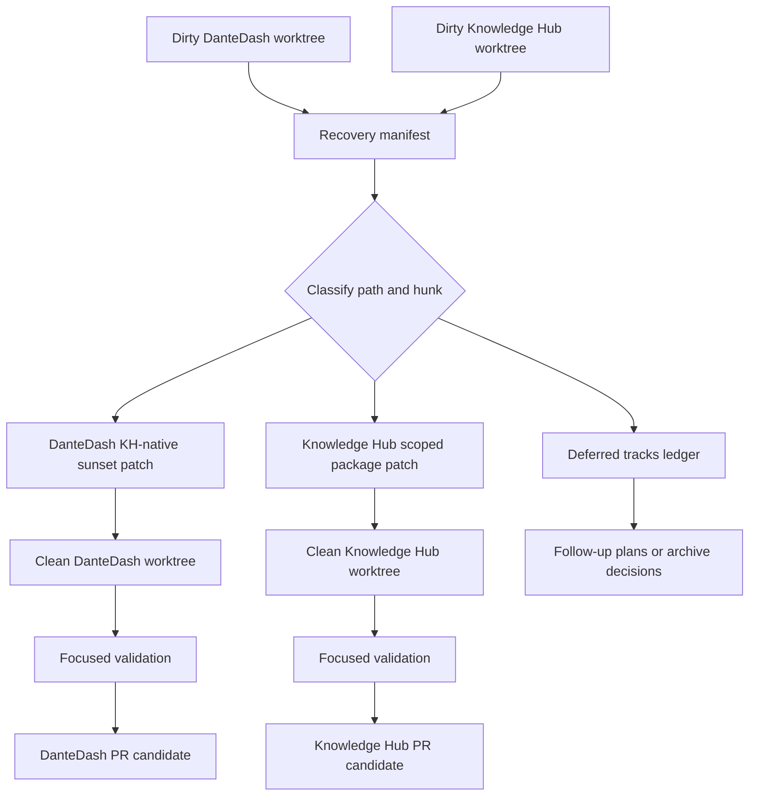

# fix: Dirty worktree commit recovery

## Summary

Recover the mixed DanteDash and Knowledge Hub worktrees into reviewable, scoped commits. The plan uses manifest-first classification, hunk-level patch extraction, clean worktree validation, and separate PRs for DanteDash and Knowledge Hub.

**Target repos:** DanteDash and Knowledge Hub. File paths are repo-relative to the repo named by each implementation unit.

---

## Problem Frame

The KH-native Chroma sunset work is operational, but the active worktrees contain unrelated changes from multiple tracks. A direct commit risks shipping UI, Graph, LightRAG, prompt, report, snapshot, and KH runtime work together. The recovery must preserve all current work while extracting only the scoped KH-native sunset changes into clean branches.

---

## Requirements

- R1. Produce a complete manifest of dirty state before any cleanup or commit.
- R2. Preserve all user and other-agent work until each file or hunk is classified.
- R3. Split DanteDash and Knowledge Hub into separate review tracks.
- R4. Separate KH-native Chroma sunset changes from unrelated UI, Graph, LightRAG, report, snapshot, and prompt work.
- R5. Split mixed files by hunk intent rather than staging whole paths.
- R6. Validate each extracted track in a clean worktree before commit.
- R7. Leave a final ledger of committed, deferred, ignored, and still-dirty items.

---

## Key Technical Decisions

- **KTD1. Manifest-first recovery:** Capture a durable state inventory before any mutation so later agents can audit what existed and why each item moved.
- **KTD2. Clean worktrees for commit candidates:** Build each commit candidate in a clean branch or worktree instead of committing directly from the mixed working copy.
- **KTD3. Hunk-level ownership:** Treat large mixed files as review units, not path units. A file can contribute one hunk to KH-native sunset and another hunk to a deferred track.
- **KTD4. Separate repository PRs:** DanteDash and Knowledge Hub changes land independently because they have different ownership, tests, and rollback surfaces.
- **KTD5. Preserve before cleaning:** Generated reports, env backups, and snapshots are classified before removal or ignore decisions. No cleanup is part of the first safe recovery pass.

---

## High-Level Technical Design

The mixed worktree remains the evidence source until every selected patch has been validated elsewhere. The clean worktrees are disposable extraction targets, not replacements for the evidence source.

---

## Implementation Units

### U1. Recovery Manifest

- **Goal:** Create a durable manifest that records every modified, untracked, and cross-repo item before any commit recovery action.
- **Requirements:** R1, R2, R7.
- **Dependencies:** None.
- **Files:** `docs/reports/dirty-worktree-recovery/manifest.md`, `docs/reports/dirty-worktree-recovery/dantedash-status.txt`, `docs/reports/dirty-worktree-recovery/knowledge-hub-status.txt`.
- **Approach:** Capture path-level status, size hints, known track guesses, and risk classification. The manifest should include DanteDash and Knowledge Hub sections with separate ownership labels.
- **Patterns to follow:** Existing report artifacts under `docs/reports/` that preserve run evidence without modifying runtime data.
- **Test scenarios:**
  - Happy path: a reader can identify every currently modified tracked DanteDash file in the manifest.
  - Happy path: a reader can identify every untracked DanteDash plan/report/snapshot category in the manifest.
  - Happy path: Knowledge Hub dirty state is recorded separately from DanteDash.
  - Edge case: generated reports and env backups are classified without exposing secrets.
- **Verification:** Manifest exists, contains both repos, and no cleanup occurred before it was written.

### U2. Scope Classification Matrix

- **Goal:** Assign each path or hunk to a commit track, deferred track, archive-only track, or ignore decision.
- **Requirements:** R3, R4, R5, R7.
- **Dependencies:** U1.
- **Files:** `docs/reports/dirty-worktree-recovery/classification.md`.
- **Approach:** Use five primary tracks: DanteDash KH-native sunset, Knowledge Hub dantedash package scoping, UI/desktop polish, Graph/LightRAG work, and generated evidence. Flag mixed files for hunk review.
- **Patterns to follow:** Plan requirement grouping style in `docs/plans/2026-07-01-001-feat-kh-native-total-chroma-sunset-plan.md`.
- **Test scenarios:**
  - Happy path: every modified tracked file has exactly one primary classification or an explicit mixed-hunk marker.
  - Edge case: files like `backend/app/kb_backends.py` and `backend/app/knowledge_hub_client.py` can be marked mixed instead of forced into one path-level group.
  - Error path: any unclassified file blocks commit candidate creation.
- **Verification:** Classification has zero unclassified tracked files and a visible list of mixed-hunk files.

### U3. DanteDash Patch Extraction

- **Goal:** Extract only the DanteDash KH-native sunset changes into a clean DanteDash branch or worktree.
- **Requirements:** R3, R4, R5, R6.
- **Dependencies:** U1, U2.
- **Files:** `backend/app/chat_runtime.py`, `backend/app/deps.py`, `backend/app/kb_backends.py`, `backend/app/kb_gateway.py`, `backend/app/schemas.py`, `backend/app/kb_cutover_score.py`, `scripts/dante_kb_runtime_env.sh`, `scripts/dantedash_kh_import_missing.py`, `scripts/dantedash_kh_parity_eval.py`, `scripts/smoke-dante-dashboard.sh`, `scripts/start-dante-multimodal-rag.sh`, `backend/tests/test_kb_gateway.py`, `backend/tests/test_kh_import_missing.py`, `backend/tests/test_kb_cutover_score.py`, `backend/tests/test_runtime_shell_env.py`, `README.md`, `docs/runbooks/dante-dashboard-operations.md`, `docs/reports/knowledge-hub-cutover-certification.md`.
- **Approach:** Reconstruct the scoped patch from the manifest and hunk review. Include only changes needed for strict KH-native runtime, Qdrant-backed search/chat/preview/image-query, cutover score, import retry hardening, smoke expectations, and documentation for the Chroma cold-backup posture.
- **Execution note:** Start by applying the smallest patch set that makes the existing focused tests pass in the clean worktree.
- **Patterns to follow:** Existing backend dependency injection via `backend/app/deps.py`, gateway pattern in `backend/app/kb_gateway.py`, and smoke conventions in `scripts/smoke-dante-dashboard.sh`.
- **Test scenarios:**
  - Happy path: KB status reports `knowledge_hub`, no Chroma fallback, strict no-Chroma, and disabled visual rescue.
  - Happy path: text search for a generic visual query returns `kb_slug=dantedash` items with analysis or decoupage layers.
  - Happy path: image-query search returns KH-native DanteDash results.
  - Edge case: a query that mentions another configured corpus may access that corpus only through the explicit corpus path.
  - Error path: the import helper retries transient KH batch failures and reports partial status only after retries are exhausted.
  - Integration: smoke confirms stats, preview, decoupage count, chat workspace route, and frontend reachability.
- **Verification:** Focused backend tests and smoke pass in the clean worktree with no unrelated UI, Graph, or LightRAG changes staged.

### U4. Knowledge Hub Patch Extraction

- **Goal:** Extract only the Knowledge Hub changes required to keep dantedash package search scoped to DanteDash.
- **Requirements:** R3, R4, R5, R6.
- **Dependencies:** U1, U2.
- **Files:** `src/knowledge_hub/hub_service.py`, `tests/test_api_v1.py`.
- **Approach:** Build a separate Knowledge Hub branch with only the scoped dantedash package search behavior and its tests. Do not include unrelated local-model, graph-native, profile, or visual-memory work unless hunk review proves it is required.
- **Execution note:** Characterize the prior fallback behavior in tests first, then invert expectations to scoped-only behavior.
- **Patterns to follow:** Existing Knowledge Hub API route tests in `tests/test_api_v1.py`.
- **Test scenarios:**
  - Happy path: dantedash text package search returns dantedash scoped results when dantedash points exist.
  - Happy path: dantedash image package search returns dantedash scoped results when dantedash points exist.
  - Edge case: when only another corpus has matching points, dantedash package search returns empty instead of falling back unscoped.
  - Error path: malformed or unavailable search still returns the existing safe error shape.
- **Verification:** Focused Knowledge Hub package search tests pass in the clean Knowledge Hub worktree.

### U5. Validation Ledger

- **Goal:** Record validation evidence for each extracted commit candidate and preserve what remains deferred.
- **Requirements:** R6, R7.
- **Dependencies:** U3, U4.
- **Files:** `docs/reports/dirty-worktree-recovery/validation-ledger.md`.
- **Approach:** For each candidate branch, record tests run, smoke result, live endpoint evidence when relevant, files included, files intentionally excluded, and remaining dirty categories.
- **Patterns to follow:** Existing cutover certification reporting in `docs/reports/knowledge-hub-cutover-certification.md`.
- **Test scenarios:**
  - Happy path: each commit candidate has a validation entry with pass/fail state.
  - Edge case: skipped tests include a reason and residual risk.
  - Error path: if validation fails, the ledger marks the candidate blocked and does not recommend commit.
- **Verification:** Ledger gives a reviewer enough evidence to decide whether each PR candidate is ready.

### U6. Commit and PR Handoff

- **Goal:** Prepare separate commit/PR handoffs without mixing deferred work.
- **Requirements:** R3, R4, R7.
- **Dependencies:** U3, U4, U5.
- **Files:** `docs/reports/dirty-worktree-recovery/final-handoff.md`.
- **Approach:** Write final PR boundaries, commit summaries, branch names, included file lists, excluded dirty categories, and rollback notes. Commit only from clean worktrees after validation passes.
- **Patterns to follow:** Existing runbook language in `docs/runbooks/dante-dashboard-operations.md`.
- **Test scenarios:**
  - Happy path: DanteDash and Knowledge Hub handoffs are separate.
  - Happy path: every remaining dirty path is either deferred, ignored, archived, or assigned to a future plan.
  - Edge case: mixed-hunk files list the rationale for included and excluded hunks.
- **Verification:** Final handoff can be read without inspecting the original dirty worktree and still explains what shipped.

---

## Scope Boundaries

In scope:

- Recovering commit hygiene for the already-implemented KH-native Chroma sunset work.
- Producing clean DanteDash and Knowledge Hub commit candidates.
- Preserving all unrelated dirty work until it is classified.

Deferred to follow-up work:

- Cleaning generated LightRAG reports and old snapshots.
- Shipping UI polish, Graph focus, persistent sidebar changes, or unrelated frontend work.
- Normalizing long-term report retention rules.
- Rewriting the feature implementation itself beyond what extraction reveals as necessary.

Out of scope:

- Destructive resets, blanket checkout, or deleting backup files.
- Combining DanteDash and Knowledge Hub into one PR.
- Re-running ingest or mutating Qdrant/Postgres/Redis as part of commit recovery.

---

## Risks & Mitigations

| Risk | Mitigation |
|---|---|
| Mixed hunks enter the wrong PR | Require hunk-level review for large shared files and block unclassified hunks. |
| Clean worktree misses an unstaged dependency | Validate from the clean worktree, not from the dirty source worktree. |
| Generated reports swamp the commit | Classify generated evidence separately and include only the report files needed by the PR narrative. |
| Knowledge Hub and DanteDash drift | Validate each repo independently, then run a cross-service smoke only after both candidates pass. |
| Other-agent work is lost | Do not reset or delete the dirty source worktree; preserve all uncommitted state until final ledger approval. |

---

## Documentation / Operational Notes

The final handoff should make clear that Chroma remains a cold rollback/export surface during the observation window, while DanteDash runtime reads are KH-native. It should also say which dirty tracks are intentionally deferred so future agents do not try to "fix" them by reverting unrelated work.

---

## Sources & Research

- Origin requirements: `docs/brainstorms/2026-07-01-dirty-worktree-commit-recovery-requirements.md`.
- Active cutover plan: `docs/plans/2026-07-01-001-feat-kh-native-total-chroma-sunset-plan.md`.
- Workspace constraints: `AGENTS.md`, `CLAUDE.md`.
- Observed dirty-state evidence from current git status and diff-size inventory.

---

## Judge Confidence

Final judge confidence: 0.94 / 1.00.

The plan clears the requested 0.93 gate because it preserves current work, separates repos, blocks unclassified files, validates in clean worktrees, and avoids destructive cleanup. The main residual risk is time cost from hunk-level extraction, which is acceptable given the current worktree contamination.
