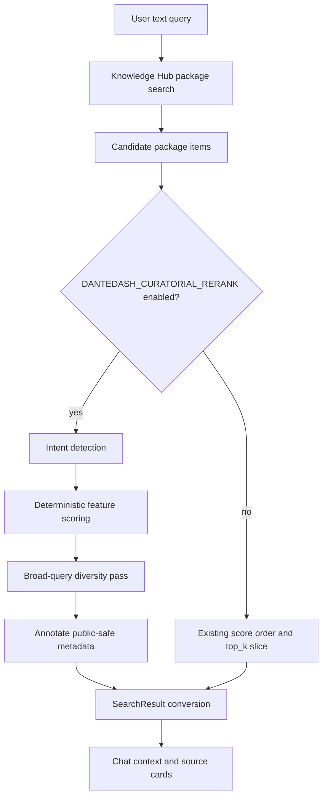

# feat: Add S-tier curatorial rerank

## Summary

Add a deterministic curatorial reranker to DanteDash Knowledge Hub search, behind `DANTEDASH_CURATORIAL_RERANK` and off by default. The first cut improves text-query ordering for visual packages by combining KH vector score, exact title/year match, package-layer quality, preview availability, and curated decoupage/card metadata without changing providers, prompts, storage, or retrieval backends.

---

## Problem Frame

The KH-native multimodal search now returns linked image packages, but broad visual requests can still surface generic text boards, low-value assets, or repeated candidates ahead of stronger film-still and premium decoupage matches. Chat then inherits that candidate order and answers defensively, even when the corpus contains richer image, Gemini card, and premium decoupage layers. The fix should restore the older sense of curated visual quality while keeping the KH-native sunset path intact.

---

## Requirements

**Ranking behavior**

- R1. Text search in `knowledge_hub` mode can optionally rerank KH package candidates using deterministic local signals instead of only backend score order.
- R2. The reranker must favor explicit film/title/year matches when the query names a specific work or frame family.
- R3. The reranker must favor premium visual evidence when the query asks for strong, S-tier, iconic, unusual, cinematic, camera, light, color, composition, or craft-based material.
- R4. The reranker must keep enough package diversity for broad discovery queries so one source family does not crowd out all other candidates.

**Safety and rollout**

- R5. The feature is controlled by `DANTEDASH_CURATORIAL_RERANK` and remains disabled by default.
- R6. When the flag is disabled, existing KH search ordering and SearchResult metadata remain unchanged except for already-existing sanitization.
- R7. The implementation must not use Chroma as a rescue path, mutate Knowledge Hub, write Qdrant/Postgres/Redis, change provider clients, or alter chat model prompts.
- R8. Rerank diagnostics must travel as public-safe per-result metadata, not as shared mutable backend state.

**Verification**

- R9. Unit tests must prove quality promotion, exact-match promotion, diversity behavior, metadata annotation, disabled-flag parity, and enabled-flag gateway wiring.
- R10. Focused backend tests must run without live provider calls or live Knowledge Hub mutation.

---

## Key Technical Decisions

- **Pure rerank module:** Put scoring and ordering in `backend/app/curatorial_rerank.py` so it can be unit-tested without FastAPI, provider clients, KH services, or Chroma.
- **Metadata-in, metadata-out:** Treat each KH package item as a dict with nested metadata, return copied items with public-safe `curatorial_*` metadata, and avoid storing request-specific state on `KnowledgeHubKbBackend`.
- **Flag at the gateway adapter boundary:** Apply the reranker inside `KnowledgeHubKbBackend.search_text`, after KH returns package candidates and before the final `top_k` slice. This preserves all existing route and chat contracts.
- **No backend rescue from bad candidates:** The first cut reorders the KH candidate set it receives. It does not issue secondary searches, query Chroma, or call a model to reinterpret the query.
- **Deterministic scores before model behavior:** Improve retrieval quality before changing chat prompts. The chat layer should receive better candidates through the same `SearchResult` surface it already uses.
- **Minimal fixtures:** Tests use small synthetic item dicts that preserve the relevant metadata shape. Large live `/api/search` captures stay out of git.

---

## High-Level Technical Design

Rerank scoring is deliberately shallow and inspectable. It should consider:

- normalized KH vector score;
- exact title, year, frame, group, and `dante_image_id` matches;
- artifact/layer fit for image, `visual_analysis_bundle`, and `visual_decoupage_bundle`;
- premium signal from available sidecar/card text and metadata, including editorial tier, score, distinction, and confidence;
- preview availability through `preview_image_file_id`, linked image ids, or image modality;
- diversity key from `source_sha256`, `dante_image_id`, `group`, or item id.

---

## Scope Boundaries

### In Scope

- Deterministic rerank for KH text-search candidate items.
- Feature flag default off.
- Public-safe `curatorial_*` metadata annotations when the flag is on.
- Unit and gateway tests.

### Deferred to Follow-Up Work

- Chat answer abstention policy for weak visual evidence.
- Prompt changes for paragraph-only or source-reference style.
- Frontend controls or badges for curatorial rerank diagnostics.
- LightRAG participation in visual ranking.
- Secondary retrieval expansion when KH returns a weak candidate pool.
- Video-specific temporal rerank.

### Out of Scope

- Reindexing or mutating Knowledge Hub, Qdrant, Postgres, Redis, Chroma, vault files, or source assets.
- Provider, OAuth, worker, judge, or model-routing changes.
- Restoring Chroma fallback behavior.

---

## Implementation Units

### U1. Curatorial Rerank Core

- **Goal:** Create the deterministic scoring and ordering module for KH package items.
- **Requirements:** R1, R2, R3, R4, R8, R9.
- **Dependencies:** None.
- **Files:**
  - `backend/app/curatorial_rerank.py`
  - `backend/tests/test_curatorial_rerank.py`
- **Approach:** Build a pure function that accepts a query and candidate item dicts, returns copied item dicts in curatorial order, and annotates selected metadata with score components. Detect coarse query intent from the query text: exact work/frame lookup, quality/curation request, visual-craft request, or generic search. Score exact-match queries more heavily on title/year/frame alignment; score broad visual requests more heavily on package quality, visual layer fit, and preview availability. Apply diversity after scoring for broad queries, but do not hide overflow candidates when there are not enough distinct packages to fill the requested result count.
- **Patterns to follow:**
  - `backend/app/kb_backends.py` for defensive dict parsing and `SearchResult` conversion style.
  - `backend/app/rag.py` for visual-source classification based on `artifact_type`, `linked_image_file_id`, and `preview_image_file_id`.
  - `docs/architecture/visual-asset-package-contract.md` for package identity fields.
- **Test scenarios:**
  - Happy path: a lower-vector S-tier or premium decoupage candidate outranks a higher-vector generic board for a quality query.
  - Happy path: a specific film/year query promotes candidates whose title, group, or `dante_image_id` matches the requested work.
  - Edge case: broad discovery queries prefer at most two candidates from the same diversity key before filling from overflow.
  - Edge case: missing nested metadata, missing scores, and malformed score strings do not raise.
  - Edge case: a text-layer decoupage item with `preview_image_file_id` is treated as visual evidence.
  - Verification: returned items are copies and contain `curatorial_score`, `curatorial_intent`, and compact score components only when rerank is applied.

### U2. KH Backend Flag Wiring

- **Goal:** Wire the reranker into KH text search behind `DANTEDASH_CURATORIAL_RERANK`.
- **Requirements:** R1, R5, R6, R7, R8, R9, R10.
- **Dependencies:** U1.
- **Files:**
  - `backend/app/deps.py`
  - `backend/app/kb_backends.py`
  - `backend/tests/test_kb_gateway.py`
- **Approach:** Add a boolean setting for `DANTEDASH_CURATORIAL_RERANK`, defaulting to false. Pass the flag into `KnowledgeHubKbBackend`, or read it through the existing settings construction path, so tests can instantiate both enabled and disabled modes. In `search_text`, keep the existing KH response validation and item sanitization path, then apply rerank only when the flag is true. Preserve the current disabled behavior exactly by slicing the original candidate order when the flag is false.
- **Patterns to follow:**
  - Existing environment parsing in `backend/app/deps.py`.
  - Existing fallback-disabled tests in `backend/tests/test_kb_gateway.py`.
  - Existing `KnowledgeHubKbBackend.search_image` retry and filtering style for bounded transformations after KH response parsing.
- **Test scenarios:**
  - Happy path: disabled flag returns the KH client order and does not add `curatorial_*` metadata.
  - Happy path: enabled flag reorders synthetic KH package items and adds public-safe curatorial metadata.
  - Edge case: enabled flag still respects `top_k`.
  - Error path: malformed KH `items` still raises the existing `knowledge_hub_items_malformed` error.
  - Integration scenario: `KbGateway` in `knowledge_hub` mode serves reranked text results without constructing Chroma when fallback is disabled.

### U3. Focused Runtime Guardrails

- **Goal:** Keep the feature operationally narrow and make smoke behavior explicit.
- **Requirements:** R5, R6, R7, R10.
- **Dependencies:** U1, U2.
- **Files:**
  - `scripts/dante_kb_runtime_env.sh`
  - `scripts/start-dante-multimodal-rag.sh`
  - `backend/tests/test_runtime_shell_env.py`
- **Approach:** Preserve the feature default as disabled in runtime scripts. If the scripts already centralize DanteDash KB env defaults, expose the flag there as an opt-in default of `false` so operators can discover it without changing app behavior. Keep shell output concise and do not print secrets.
- **Patterns to follow:**
  - Existing script defaults for `DANTEDASH_KB_BACKEND` and `DANTEDASH_CHROMA_FALLBACK_ENABLED`.
  - Existing shell-env tests in `backend/tests/test_runtime_shell_env.py`.
- **Test scenarios:**
  - Happy path: unset runtime env keeps `DANTEDASH_CURATORIAL_RERANK=false`.
  - Happy path: a caller-provided `DANTEDASH_CURATORIAL_RERANK=true` is preserved by the shell helper.
  - Verification: startup output may mention the flag state but must not print credentials or unrelated env.

### U4. Focused Verification Pass

- **Goal:** Prove the first cut is safe, deterministic, and behavior-preserving when disabled.
- **Requirements:** R9, R10.
- **Dependencies:** U1, U2, U3.
- **Files:**
  - `backend/tests/test_curatorial_rerank.py`
  - `backend/tests/test_kb_gateway.py`
  - `backend/tests/test_runtime_shell_env.py`
- **Approach:** Run the smallest backend test set that covers the new module, gateway wiring, and runtime env defaults. Add broader backend or frontend checks only if implementation touches shared schema, route, or frontend files.
- **Test scenarios:**
  - Happy path: new curatorial unit tests pass without live services.
  - Integration scenario: KH backend focused tests pass with the fake client.
  - Regression scenario: runtime shell env tests pass with the flag unset and set.

---

## Risks & Dependencies

- **Heuristic overfit:** A deterministic score can over-promote assets that mention S-tier language weakly. Mitigation: keep the first cut inspectable, annotate score components, and cover exact-match plus broad-query fixtures separately.
- **Metadata variability:** KH package items may use different field names across image, card, decoupage, and Pirata assets. Mitigation: parse defensively from both top-level and nested metadata, and default missing features to neutral values.
- **Silent behavior drift when disabled:** The flag must be false by default and disabled-mode tests must assert existing order and metadata shape.
- **Query wording variance:** Portuguese and English visual-quality terms both matter. Mitigation: include a compact bilingual term list in the reranker and keep future expansion data-driven.

---

## Documentation / Operational Notes

The first implementation should not advertise the flag as a product feature in the UI. If startup scripts expose it, the description should be operational: deterministic KH candidate rerank, disabled by default, safe to toggle for search-quality smoke tests.

---

## Sources / Research

- `backend/app/kb_backends.py` shows the KH adapter, candidate parsing, public sanitization, preview lookup, and `SearchResult` conversion boundary.
- `backend/app/kb_gateway.py` shows the backend mode and Chroma fallback rules that must remain unchanged.
- `backend/app/deps.py` shows environment-based setting construction and runtime default patterns.
- `backend/app/rag.py` shows how chat already treats visual analysis and decoupage text layers as image-bearing context.
- `backend/tests/test_kb_gateway.py` provides fake KH clients and gateway assertions to extend.
- `backend/tests/test_runtime_shell_env.py` provides shell-default test patterns.
- `docs/architecture/visual-asset-package-contract.md` defines the image, visual card, and premium decoupage package contract.
