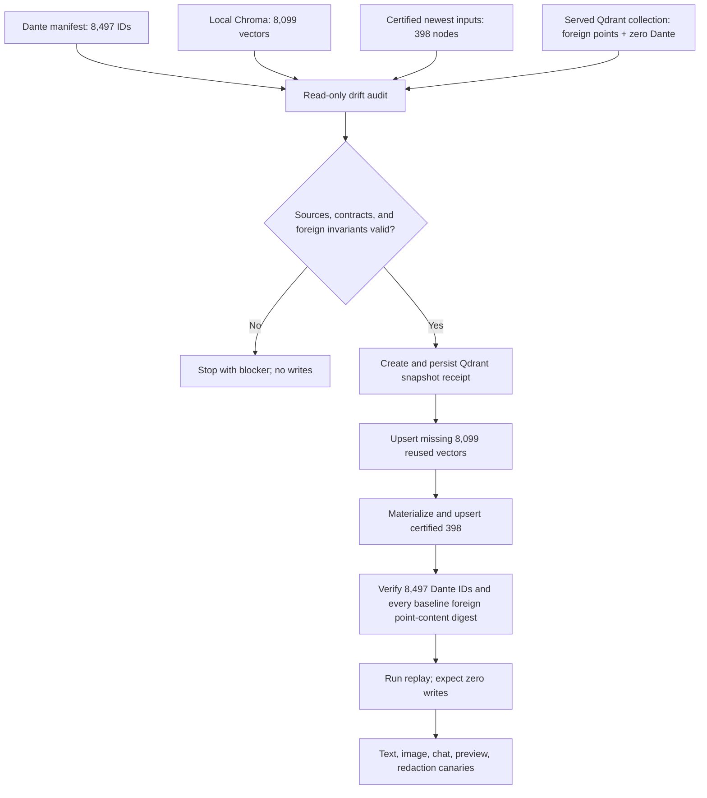
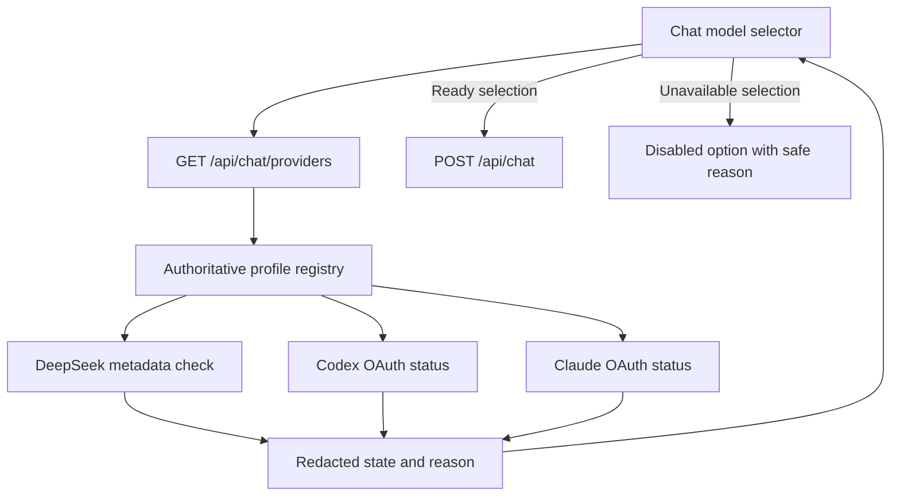

# fix: Recover DanteDash visual retrieval and provider readiness

## Summary

Recover DanteDash text-to-visual and image retrieval without resetting the shared Qdrant collection, make the recovery additive and replay-safe, surface manifest-to-vector drift, fix empty-result chat behavior, and expose truthful provider availability. The rollout snapshots the current vector collection before writes, preserves every foreign point, restores the 8,099 locally backed Dante nodes only if their Voyage provenance receipt validates, and materializes the remaining 398 manifest nodes only from immutable certified inputs.

---

## Execution Amendment — 2026-08-13

The adversarial implementation review rejected the proposed live recovery executor. A process-local lease and an unbound snapshot receipt cannot prove crash-safe writer exclusion, replay, or exact rollback, and the current Chroma store has no direct provenance receipt binding its database digest, complete node-ID set, and vector digest to the historical Voyage run. The incident repair therefore ships only the fail-closed subset in this iteration:

- remove shared-collection reset behavior and block candidate writes that lack durable promotion;
- expose authenticated read-only drift evidence and manifest/vector ID parity without declaring content readiness;
- produce an owner-private dry-run inventory that labels Qdrant rows and Stage B payload evidence as unverified;
- fix no-result chat streaming and truthful provider readiness/UI;
- make no live Qdrant recovery writes and make no zero-write replay claim.

Requirements R2–R6, R10, R19, R21, and R22 remain rollout gates rather than completed implementation. Live restoration requires a separately reviewed durable run ledger, restart-safe writer fencing, externally persisted snapshot receipt, direct vector provenance receipt (or separately budget-authorized re-embedding), exact content comparison, and an independently verified rollback path. Until those exist, the served Dante vector count remains degraded and recovery execution is intentionally unavailable.

---

## Problem Frame

The live Dante package manifest reports 8,497 assets while the active Qdrant visual collection contains 1,757 points and zero points with `kb_slug=dantedash`. Text and image package searches therefore return successful but empty responses. A normal visual sync and the candidate backfill both call `reset_collection` on a collection shared by multiple producers, then repopulate only physically discovered assets; this preserves the foreign Dante manifest but deletes its synthetic vectors.

The dashboard compounds the data failure in two places. A final no-results `GroundedAnswer` is not emitted as an SSE message, which leaves an empty assistant bubble, and the current image adapter treats a healthy empty KH result as backend unavailability. Provider readiness is also misleading: DeepSeek and Codex are healthy, while Claude has no OAuth session, but the current preflight checks only binary and model names and keeps every mode selectable.

---

## Requirements

**Vector ownership and recovery**

- R1. Visual sync and candidate backfill must never delete or recreate a served collection shared by multiple producers.
- R2. The Dante restore must be additive, scoped to deterministic Dante point IDs, and preserve every pre-existing foreign point byte-for-byte. The invariant is a canonical per-point digest over ID, complete payload, vector bytes and name, plus the collection contract; count and ID-set fingerprints alone are insufficient.
- R3. A replay with identical inputs must classify all recovered rows as exact and perform zero vector or manifest writes.
- R4. This Dante incident recovery must have a completed Qdrant snapshot receipt with collection configuration, checksum, size, total count, per-corpus counts, and ID fingerprints captured before the first write. Routine additive visual sync is not required to snapshot on every run, but it must enforce dimension and ownership invariants and may never delete or recreate the served collection. Knowledge-Hub-wide governance for unrelated destructive or route-switching mutations is deferred.
- R5. Recovery must derive its expected set from the current 8,497-node manifest rather than a historical total. The 8,099 local 1,024-dimensional embeddings may be reused only after a provenance receipt binds the current Chroma database digest, every row, the `voyage-multimodal-3.5`/1,024 code migration at `a933ab8`, and the contemporaneous Voyage workspace certification; otherwise stage A is blocked and requires a separately budget-authorized re-embed. The remaining 398 must be rebuilt only from certified immutable inputs under the current Voyage family.
- R6. Recovery is fail-closed per independent source stage: snapshot, collection-contract, or foreign-point invariant failure blocks all writes; a Chroma-stage validation failure blocks the 8,099-row stage; and a certified-input failure blocks the 398-row stage before that stage writes. A completed, independently validated 8,099-row stage may remain served as `searchable_degraded` while the certified remainder is blocked, but full parity may not be claimed.

**Truthful retrieval and user behavior**

- R7. KH package stats must expose manifest count, actual vector count for `kb_slug=dantedash`, drift count, collection, family, and a truthful readiness state without revealing private paths.
- R8. Healthy text or image search with zero items must remain a successful empty result, while manifest/vector drift must remain observable as degraded readiness rather than a transport failure.
- R9. A chat turn with no grounded results must emit the final no-results answer as a normal SSE message and persist the same text when a thread exists.
- R10. Known text-to-visual, image-query, and chat canaries must return Dante sources after recovery, and public responses must pass the existing local-path and secret redaction gates.

**Provider and operator readiness**

- R11. The backend must expose a cached, redacted provider-status contract sourced from the authoritative chat profile registry. Authentication, current execution capacity, and last explicit smoke evidence are separate fields; an auth-status command alone may report `authenticated_unverified`, never fully ready.
- R12. Provider state must distinguish ready, auth required, OAuth expired, usage limited, rate limited, billing blocked, model unavailable, timeout, and integration error without displaying account or credential details.
- R13. Routine provider status must use non-generative checks; a provider probe that spends tokens must run only as an explicit operator smoke.
- R14. The frontend must disable unavailable models and show a safe reason; it must never silently route a selected mode to another provider or to API-key billing.
- R15. Claude Sonnet and Opus must remain visibly unavailable until the official Claude browser login succeeds; DeepSeek, Codex, and GitHub must not be relogged or reconfigured because their current checks are green.
- R16. Provider status must remain a single-user loopback surface: trusted Host only, cross-site Origin and Fetch Metadata rejected, non-loopback startup refused unless authenticated, and CLI probes single-flight plus rate-limited.
- R17. Provider adapters, exceptions, logs, and receipts must discard raw CLI stdout/stderr after in-memory classification and emit fixed redacted cause codes only.

**Delivery and rollback**

- R18. Work must be developed in clean worktrees from the exact feature commits that already contain the live Dante APIs, then integrated into the dirty operator checkouts hunk-by-hunk without reverting unrelated WIP.
- R19. Unit, integration, browser, and live smoke gates must prove recovery, replay, failure preservation, provider classification, empty-result UX, and rollback evidence before completion.
- R20. The final report and workspace snapshot must record exact before/after counts, snapshot identifiers, tests, provider states, commits, PRs, residual blockers, and the next safe action.
- R21. The live recovery service must require the owner-configured actions bearer plus a request bound to the collection, exact recovery-plan digest, snapshot identifier/checksum, and pre-existing foreign point-content digest. It revalidates the bound collection and every baseline foreign point before each batch. Missing, stale, altered, or unauthorized requests fail before that batch writes; deterministic IDs and the settled-batch ledger make authorized replay zero-write.
- R22. Full Qdrant snapshot artifacts must live outside the repository under owner-only directories and files, reject symlinks, verify checksum after copy, omit absolute paths from public reports, and follow a documented retention and verified-deletion policy. External copies require encryption.

---

## Scope Boundaries

- Do not reset, clear, broadly delete, or rebuild the active shared Qdrant collection in place. The only permitted active rollback deletion is the exact recorded set of Dante point IDs newly inserted by this recovery, under the same authenticated lease and post-delete foreign-content verification.
- Do not run broad `ingest_sync`, text ingest, graph promotion, Chroma fallback, or workspace reindex as part of this repair.
- Do not delete the local Chroma rollback store or claim that it contains the newest 398 nodes.
- Do not add image upload to the chat composer. This repair restores text-to-visual chat retrieval; query-by-image remains in the Search panel.
- Do not expose private asset paths, provider keys, OAuth tokens, account identifiers, raw CLI output, or balances in public API or UI payloads.
- Do not force logout or silently initiate a different billing route. Claude authorization may only use its official user-visible browser flow.
- A generational Qdrant collection plus alias flip is the long-term rebuild architecture, but it is not required for the urgent additive restore. This plan adds the safety seams needed to adopt it later.

---

## Context and Research

- Knowledge Hub target repository: `/Users/vidigal/projects/knowledge-hub`. Paths beginning with `src/` or `tests/` in KH units are relative to that repository.
- DanteDash target repository: this repository. Paths beginning with `backend/`, `frontend/`, `scripts/`, or `docs/` are relative to DanteDash.
- Clean implementation anchors: Knowledge Hub commit `4bfdbce` on `codex/kh-dantedash-image-query`; DanteDash commit `e54815b` on `codex/docling-resume-safety`. Any live-only WIP dependency is copied as an inspected hunk, never by resetting either operator checkout.
- `src/knowledge_hub/hub_service.py` currently resets the shared collection in `_sync_visual_memory_embeddings` and `backfill_visual_candidate`; `src/knowledge_hub/runtime.py` implements that reset as delete-then-create.
- `src/knowledge_hub/visual_memory.py` already protects foreign manifest files by schema ownership. The vector lifecycle must adopt the same ownership boundary.
- `scripts/dantedash_kh_import_missing.py` already imports with `reset_collection=false` and batches through the KH-owned API, while `backend/app/docling_black_label_qwen_visual_next100_apply.py` contains certified materialization rules for the newest reviewed corpus.
- Current disk evidence: the manifest has 8,497 unique node IDs; local Chroma has 8,099 IDs, all overlapping the manifest; 398 manifest nodes are not in Chroma and consist of 192 extracted images, 101 page packages, and 105 reviewed visual cards.
- Chroma family evidence is indirect but specific: all current rows are 1,024-dimensional; `backend/app/kb.py` changed from the incompatible 768-dimensional Gemini preview to fixed `voyage-multimodal-3.5`/1,024 at commit `a933ab8`; and `snapshots/DEEP_MEMORY_DANTEDASH_003.md` records the Voyage provider/model contract. U3 must turn this chain plus the database and row digests into an explicit provenance receipt before reuse; dimension alone is not sufficient.
- Current provider evidence: DeepSeek reports available with a positive balance and a real minimal completion succeeds; Codex is logged in through ChatGPT OAuth and a bounded `gpt-5.5` probe succeeds; Claude reports `loggedIn=false`; the stored GitHub credential is invalid and the user-visible device flow currently fails with HTTP 503 after code entry.
- Historical incident evidence in `snapshots/DEEP_MEMORY_DANTEDASH_008.md` shows that foreign-manifest ownership already failed once. The previous fix protected JSON only, so the new regression test must cover import followed by normal visual sync.

---

## Key Technical Decisions

- KTD1. **Use additive upsert-only recovery for the incident:** the live collection contains valid foreign points and zero Dante points, so deterministic Dante upserts restore service without deleting anything. A shadow collection and atomic alias are safer for future full rebuilds, but adding alias plumbing is unnecessary for this urgent delta.
- KTD2. **Replace automatic resets with ownership-aware convergence:** normal sync ensures the collection and upserts expected owned IDs. It reports stale owned IDs but never prunes automatically. Any future prune must be a separate snapshot-required operator action filtered by strong writer ownership.
- KTD3. **Keep destructive intent out of the Dante service contract:** the public API already rejects `reset_collection=true`; the service must reject it too so internal callers cannot bypass the route guard.
- KTD4. **Classify before writing:** compare deterministic point ID, payload identity hashes, embedding family, dimension, finiteness, and vector digest as `exact`, `missing`, `stale`, or `conflict`. Write only missing or explicitly compatible stale rows; fail closed on identity conflict. Foreign postflight requires equality of every baseline foreign point-content digest; disjoint new foreign points are allowed and reported, while mutation or deletion of any baseline point blocks the next batch.
- KTD5. **Use two independently certified restore sources:** reuse the 8,099 local embeddings without provider spend only after the historical Voyage provenance receipt validates; otherwise block stage A pending separately authorized re-embedding. Reconstruct the remaining 398 from their certified immutable inputs. A missing or hash-mismatched input leaves a named blocker instead of inventing a vector.
- KTD6. **Snapshot first; roll back the incident by exact owned delta:** create a native Qdrant snapshot before mutation and persist its receipt outside the container storage lifecycle. The primary incident rollback deletes only the recorded Dante IDs newly inserted by the failed run, verifies all baseline foreign point-content digests, and returns to the known pre-run state. The snapshot restore drill remains disaster evidence and always targets a non-served collection; no configuration or alias switch is required for this additive incident.
- KTD7. **Make readiness prove retrievability, not inventory:** package stats combine manifest and filtered vector counts. A manifest-only count can remain useful for library browsing but cannot produce a green search-ready state.
- KTD8. **Treat empty data as data, not transport failure:** `status=ok` with `items=[]` returns an empty list. The chat route emits the final answer when no token chunks were streamed, so the user receives a useful response without invoking a provider on ungrounded input.
- KTD9. **Use non-generative provider health by default:** DeepSeek balance/model metadata and CLI auth-status commands are cached and redacted behind a loopback, same-site, single-flight boundary. Raw command output is discarded after classification. CLI auth produces `authenticated_unverified`; only provider metadata that proves capacity or a fresh explicit smoke receipt can produce ready. Runtime `ProviderError` text updates safe cause/capacity state, while paid generation remains an explicit smoke.
- KTD10. **Keep provider isolation strict:** unavailable Claude modes are disabled rather than redirected. OAuth subprocesses continue stripping API-key environment variables, and the provider-status endpoint never returns auth-store contents.
- KTD11. **Integrate around dirty worktrees:** implement from clean feature tips, keep commits narrow by repository and concern, and transplant only reviewed hunks into the live dirty checkouts after tests pass.

---

## High-Level Technical Design

The diagrams are directional and show safety gates and ownership boundaries rather than exact implementation syntax.

---

## Implementation Units

### U1. Add scoped vector inspection and snapshot receipts in Knowledge Hub

- **Goal:** Provide the read-only and backup primitives required to prove ownership, detect drift, classify rows, and protect rollback before writes.
- **Requirements:** R2, R3, R4, R6, R7
- **Dependencies:** None
- **Files:**
  - Modify: `src/knowledge_hub/runtime.py`
  - Modify: `src/knowledge_hub/hub_service.py`
  - Modify: `src/knowledge_hub/main.py`
  - Test: `tests/test_hub_service.py`
  - Test: `tests/test_api_v1.py`
  - Test: `tests/test_hub_service.py`
- **Approach:** Extend the vector-store boundary with filtered count/scroll or equivalent scoped inspection, vector digest retrieval, and native snapshot creation. Add a redacted Dante drift report that compares manifest IDs with `kb_slug=dantedash` points and records a canonical digest for each baseline foreign point over its ID, complete payload, vector bytes/name, and collection contract. Public summaries expose only aggregate digests. Snapshot receipts must include a durable identifier and must be complete before a recovery execution request is accepted.
- **Test scenarios:** In-memory and fake-Qdrant tests cover no collection, empty Dante scope with foreign points, exact parity, missing/stale/conflict classifications, non-finite or wrong-dimension vectors, paginated scroll, snapshot failure, and redacted receipts.
- **Verification:** A read-only audit reports 8,497 expected, zero actual Dante, and the unchanged foreign baseline without mutating the collection.

### U2. Remove destructive shared-collection resets

- **Goal:** Make normal visual sync and candidate backfill additive and failure-preserving.
- **Requirements:** R1, R2, R6
- **Dependencies:** U1
- **Files:**
  - Modify: `src/knowledge_hub/hub_service.py`
  - Modify: `src/knowledge_hub/runtime.py`
  - Test: `tests/test_visual_memory.py`
  - Test: `tests/test_hub_service.py`
- **Approach:** Replace reset calls with dimension-checked `ensure_collection` plus deterministic upserts. Record expected owned IDs and stale owned IDs without pruning. Remove failure cleanup that clears a partially updated collection. Reject `reset_collection=true` inside the Dante import service as defense in depth.
- **Writer fence:** Add a KH-owned recovery-session lease at the vector boundary, authenticated by the actions bearer and bound to collection, plan digest, snapshot receipt, and baseline content digest. Every KH vector-mutating path rejects or waits while the incompatible lease is active; each batch checks a writer epoch. The lease has bounded expiry and safe release/reconciliation after restart. External disjoint additions remain detectable and allowed, but any mutation or deletion of a baseline foreign point stops the next batch.
- **Manifest epoch:** Hash the complete 8,497-row manifest into the recovery plan. Any manifest change invalidates all unstarted stages and requires a new dry run; a settled stage remains historically certified only for its recorded manifest digest and cannot be used to claim current full parity.
- **Test scenarios:** Import a foreign Dante point, run physical visual sync, and prove it survives; inject an embedding failure mid-run and prove old plus foreign points remain; retry and prove convergence; run candidate backfill against a collection shared with foreign points; call the service directly with reset requested and expect refusal.
- **Verification:** No automatic code path under normal sync or candidate backfill calls delete/recreate on the served visual collection.

### U3. Build an idempotent Dante recovery harness

- **Goal:** Plan, execute, resume, and verify a delta-only restore through the KH-owned import API.
- **Requirements:** R2, R3, R4, R5, R6, R18, R21, R22
- **Dependencies:** U1, U2
- **Files:**
  - Modify: `scripts/dantedash_kh_import_missing.py`
  - Create: `scripts/dantedash_kh_visual_recovery.py`
  - Modify: `backend/app/kb_parity.py`
  - Test: `backend/tests/test_kh_import_missing.py`
  - Test: `backend/tests/test_kh_parity.py`
  - Create: `backend/tests/test_kh_visual_recovery.py`
- **Approach:** Make manifest IDs authoritative and classify current Qdrant state through the new KH audit API. Stage A reuses the 8,099 Chroma embeddings only if the database/row digest plus historical migration and workspace certification produce the required Voyage provenance receipt. Stage B uses recovery-local adapters in the new harness, driven by Qdrant-missing deterministic IDs rather than manifest existence: embed image bytes for extracted-image nodes and canonical manifest text for page/card nodes, after validating each recorded immutable source/hash. Inventory all 398 IDs with adapter, immutable source, digest, family, and dimension before execution. Freeze each stage into an owner-only immutable per-run source bundle that binds node ID, canonical content/input hash, payload identity, embedding family/model contract, dimension, and vector digest; revalidate the bundle and baseline foreign point digests immediately before every batch. Persist an owner-only run ledger with input hashes, batch states, snapshot receipt, foreign baseline, per-row classification, and postflight evidence. Live execution requires the owner-configured actions bearer and receipt-bound plan fields after preflight; resume only from settled batches and verify before advancing. Generate run IDs internally as bounded UTC-plus-random slugs and prove all resolved report paths remain under a fixed no-symlink root.
- **Test scenarios:** Dry run performs zero writes; live mode refuses without actions bearer, snapshot receipt, or matching plan/baseline fields; lost response plus retry does not double-count; partial batch failure resumes; identity conflict blocks; source bundle changes between batches are quarantined; an absent newest source blocks stage B before any stage-B write, retains a certified stage-A restore as `searchable_degraded`, and identifies the uncertified set; exact replay plans zero writes; every baseline foreign point remains exact while disjoint foreign additions are allowed and reported; traversal and symlink report paths are rejected.
- **Verification:** A dry-run plan either certifies exactly 8,099 reusable Voyage nodes or blocks stage A with the missing provenance evidence, and independently names exactly 398 Qdrant-missing recovery nodes with a complete source-and-hash matrix.

### U4. Expose vector-backed Dante readiness

- **Goal:** Prevent manifest-only inventory from masquerading as healthy retrieval.
- **Requirements:** R7, R8, R10
- **Dependencies:** U1
- **Files:**
  - Modify: `src/knowledge_hub/hub_service.py`
  - Modify: `src/knowledge_hub/main.py`
  - Test: `tests/test_visual_memory.py`
  - Test: `tests/test_api_v1.py`
  - Modify: `backend/app/kb_backends.py`
  - Modify: `backend/app/kb_gateway.py`
  - Test: `backend/tests/test_kb_gateway.py`
- **Approach:** Enrich package stats and gateway status with filtered vector counts and readiness. Keep a healthy empty search as an empty list, but retain the degraded drift reason in status. Preserve strict no-Chroma operation and existing public metadata sanitization.
- **Test scenarios:** Manifest present with zero vectors reports degraded; exact parity reports ready; malformed vector stats fail safely; healthy `items=[]` returns `[]` for image search instead of 503; transport and KH-unavailable responses still produce 503; nested metadata cannot leak local paths.
- **Verification:** The dashboard can distinguish empty corpus, drifted corpus, and unavailable transport without a fallback read.

### U5. Fix final-answer streaming for no-result chat turns

- **Goal:** Eliminate empty assistant bubbles and preserve a deterministic no-results response.
- **Requirements:** R8, R9, R10
- **Dependencies:** U4
- **Files:**
  - Modify: `backend/app/routes/chat.py`
  - Test: `backend/tests/test_chat_routes.py`
  - Test: `backend/tests/test_chat_prompt_integration.py`
  - Modify: `frontend/src/hooks/useChat.ts`
  - Create: `frontend/src/hooks/useChat.test.ts`
- **Approach:** If the final `GroundedAnswer` contains answer text and no token chunks were emitted, send that text as one normal message frame before sources and done. Keep persistence content identical to the emitted answer and avoid duplicating providers that already streamed tokens. Add a frontend defensive fallback only for malformed streams that end without content or error.
- **Test scenarios:** No retrieval results emit one message, empty sources, and done; normal streamed provider output is not duplicated; persisted thread content matches the client; an aborted/error stream remains distinct; frontend never leaves a completed blank assistant bubble.
- **Verification:** A one-shot no-result chat visibly returns the friendly no-results text.

### U6. Add truthful provider readiness and safe error classification

- **Goal:** Separate auth, quota, billing, model, timeout, and integration failures and make the result available to clients without secrets.
- **Requirements:** R11, R12, R13, R14, R15, R16, R17
- **Dependencies:** None
- **Files:**
  - Modify: `backend/app/provider_preflight.py`
  - Modify: `backend/app/providers.py`
  - Create: `backend/app/routes/provider_status.py`
  - Modify: `backend/app/main.py`
  - Modify: `backend/app/schemas.py`
  - Modify: `scripts/start-dante-multimodal-rag.sh`
  - Modify: `backend/tests/test_runtime_shell_env.py`
  - Test: `backend/tests/test_provider_preflight.py`
  - Create: `backend/tests/test_provider_status_routes.py`
  - Test: `backend/tests/test_chat_routes.py`
- **Approach:** Add bounded subprocess auth-status adapters using the same sanitized environments as runtime clients, a safe DeepSeek metadata checker, normalized failure causes, a short TTL cache, and a process-wide single-flight/rate limiter. The launcher normalizes and exports the effective bind address and authentication policy before Uvicorn; process startup rejects a non-loopback bind without authentication. Enforce trusted Host, Origin, and Fetch Metadata on the route. Return separate auth, capacity, and last-smoke states per public profile from the existing registry. Auth-only checks return `authenticated_unverified`; fresh explicit smoke receipts or authoritative provider metadata may promote to ready. Maintain a redacted runtime-readiness overlay keyed by public profile: classified chat failures override cached probes with per-cause TTLs, successful execution or authoritative probes clear or downgrade the overlay, and the client refreshes status after a classified failure. Discard raw stdout/stderr after parsing and return or log only safe cause and recovery hints.
- **Test scenarios:** Logged-in/out and malformed CLI JSON; binary missing; timeout; rate/usage/billing/model strings; DeepSeek key absent, balance blocked, or models unavailable; cache hit/expiry and concurrent callers; API-key variables absent from OAuth subprocesses; hostile Host/Origin/Fetch Metadata and non-loopback bind; log capture proves no path, token, balance, account, auth URL, stdout, or stderr leakage.
- **Verification:** Current live status classifies DeepSeek ready from metadata plus the explicit smoke receipt, Codex ready only while its fresh explicit smoke receipt remains valid (otherwise `authenticated_unverified`), and both Claude modes `auth_required` until OAuth succeeds.

### U7. Wire provider availability into the model selector

- **Goal:** Prevent users from selecting a provider that cannot execute and explain the safe next action.
- **Requirements:** R11, R14, R15
- **Dependencies:** U6
- **Files:**
  - Modify: `frontend/src/lib/api.ts`
  - Modify: `frontend/src/hooks/useChat.ts`
  - Modify: `frontend/src/components/ChatPanel.tsx`
  - Modify: `frontend/src/index.css`
  - Modify: `frontend/package.json`
  - Modify: `pnpm-lock.yaml`
  - Create: `frontend/vitest.config.ts`
  - Create: `frontend/src/test/setup.ts`
  - Create: `frontend/src/components/ChatPanel.test.tsx`
- **Approach:** Load provider status when the chat workspace mounts, merge it with stable model IDs, disable unavailable options, and show compact state text. Keep three distinct UI states: `checking` shows neutral progress with send disabled; `verification_error` shows a retry action; and `verified` shows each unavailable provider's safe recovery hint, with retry offered only for retryable causes. If a previously stored selection becomes unavailable, keep it visibly selected, disable sending, and require the user to choose an available provider explicitly; never switch during an in-flight turn. Show a keyboard-reachable Refresh provider status action whenever any profile is unavailable; refresh preserves selection and in-flight turns, re-enables newly ready profiles without sending, and announces the result. Expose the adjacent status region through `aria-describedby`, use `aria-live` for state changes, and never require focus on a disabled option to learn its reason.
- **Test scenarios:** Checking, verification error, mixed readiness, verified all-unavailable, stale local selection, refresh after OAuth success, runtime failure overlay and clear-on-success, nonretryable causes without a misleading retry, keyboard and screen-reader reason discovery, disabled Claude options, and ready DeepSeek/Codex selection. Use Vitest plus Testing Library for unit interaction tests and the LFG browser pipeline for the live empty-result/provider-selector flow.
- **Verification:** Sonnet and Opus are visibly disabled before login, while DeepSeek and Codex remain selectable.

### U8. Execute the guarded live retrieval restore

- **Goal:** Restore live retrieval as soon as its independent safety gates pass, prove non-regression, and leave durable rollback evidence without waiting for provider UI work.
- **Requirements:** R2, R3, R4, R5, R6, R10, R19, R21, R22
- **Dependencies:** U1-U5
- **Files:**
  - Modify: `scripts/smoke-dante-dashboard.sh`
  - Modify: `docs/runbooks/dante-dashboard-operations.md`
  - Create: `backend/runtime_reports/visual-recovery/<run-id>/...`
- **Approach:** Record the integrated dirty-tree diff and rerun all relevant unit/integration gates after transplant. Activate only that exact tested retrieval tree, verify its health plus the new audit/import endpoints, and then capture preflight counts and point-content digests. Create and persist the Qdrant snapshot under a fixed non-repository 0700 directory with 0600 files using no-follow atomic copy, verify its checksum, restore the persisted copy into a non-served drill collection, and verify its collection contract, corpus counts, and point-content digests before removing only the drill collection. Run dry-run with the owner-configured actions bearer and receipt-bound plan, restore stage A's 8,099 reusable nodes, and immediately certify text/image/chat recovery as `searchable_degraded`. Then materialize stage B's certified 398 only if its complete independent preflight validates, run postflight and replay, and upgrade readiness to full parity. Preserve machine-readable receipts owner-only, publish only redacted summaries, and record a retention window with verified deletion after the rollback window expires.
- **Test scenarios:** Snapshot creation refusal; dry-run/read mismatch; baseline foreign mutation versus allowed disjoint addition; recovery lease conflict, expiry, and restart reconciliation; service restart between batches; postflight short count; replay writes; known query with no visual source; preview unavailable; stage B blocked after stage A certification; exact inserted-ID rollback; snapshot restore drill into an isolated collection.
- **Verification:** Stage A certifies exactly 8,099 Dante vectors and a modality/artifact-stratified canary suite with `searchable_degraded`; full success upgrades to 8,497 and ready only after stage B. In both states every baseline foreign point-content digest remains exact, disjoint foreign additions are separately reported, total count equals the collision-checked union, replay writes zero rows, chat renders a non-empty response, and all public payloads pass redaction.

### U9. Repair and certify provider readiness

- **Goal:** Attempt the requested Claude agent repair through the official flow, certify provider-state UX independently of retrieval recovery, and record any external authorization blocker precisely.
- **Requirements:** R11-R17, R19, R20
- **Dependencies:** The OAuth attempt and provider UI depend on U6-U7. Final report and snapshot finalization additionally require U8 completion.
- **Files:**
  - Modify: `scripts/smoke-dante-dashboard.sh`
  - Modify: `docs/runbooks/dante-dashboard-operations.md`
  - Create: `docs/reports/2026-08-13-dantedash-visual-recovery-report.md`
  - Create: next sequential `snapshots/DEEP_MEMORY_DANTEDASH_<NNN>.md`
  - Modify: `snapshots/index.md`
  - Modify: `snapshots/LATEST.md`
- **Approach:** Launch the official Claude browser OAuth login, wait for a bounded authorization window while other work continues, and rerun the non-generative status check. Record either restored readiness or `external_authorization_required`; never relog or alter a provider whose current probe remains green. Deploy and verify the provider-status route and selector states independently, then combine provider and retrieval evidence in the final report and snapshot.
- **Test scenarios:** Claude authorization succeeds; the bounded window expires; login is cancelled; GitHub or another provider changes state during the run; provider status remains unavailable; selected unavailable provider remains visible and send-disabled until an explicit user choice.
- **Verification:** Every configured model displays current redacted readiness, no provider is silently substituted, Claude is either restored through OAuth or accurately blocked, and report/snapshot pointers resolve to the final evidence.

---

## Acceptance Examples

- AE1. **Foreign survival:** Given one Dante point and one physical visual point share a collection, when normal visual sync runs, then both IDs remain and no collection reset occurs.
- AE2. **Replay safety:** Given a completed 8,497-node restore, when the same input-hashed recovery plan runs again, then it reports 8,497 exact rows and zero writes.
- AE3. **Source-scoped fail-closed recovery:** Given stage A is certified and a source hash among the newest 398 mismatches, when stage B reaches preflight, then no stage-B write begins, stage A remains searchable with degraded corpus readiness, and the report names the blocking node.
- AE4. **Truthful readiness:** Given a manifest count of 8,497 and zero Dante vectors, when package stats are requested, then inventory remains 8,497 but search readiness is degraded with drift 8,497.
- AE5. **Healthy empty image search:** Given KH responds `status=ok` and `items=[]`, when the dashboard image adapter receives it, then it returns an empty result list rather than 503.
- AE6. **Visible no-results chat:** Given text retrieval returns no sources, when chat completes, then the client receives one friendly answer frame, empty sources, and done with no provider call.
- AE7. **Provider truth:** Given Claude reports `loggedIn=false`, when provider status loads, then both Claude modes are disabled with `auth_required`; DeepSeek and Codex remain enabled and no fallback occurs.
- AE8. **Rollback evidence:** Given any post-write invariant fails, when the operator evaluates rollback, then the report points to a pre-write snapshot that can be recovered into a non-served collection and verified before any switch.

---

## System-Wide Impact

- **Data lifecycle:** The visual collection changes from destructive whole-collection refresh to additive, ownership-scoped convergence. Stale deletion becomes a separate governed concern.
- **API contracts:** KH stats gain readiness fields without removing existing totals. DanteDash gains a provider-status endpoint and safe provider cause codes.
- **Failure propagation:** Retrieval drift, backend transport failure, and provider failure remain distinct from each other through KH, dashboard backend, SSE, and UI.
- **Caching:** Provider status is briefly cached to avoid spawning CLI status commands per render. Cache entries contain only redacted state.
- **Security and privacy:** Local-only import and image-query guards remain. Snapshot and recovery receipts may contain operational identifiers and stay owner-only; public APIs return no paths or credential material.
- **Performance:** Filtered Qdrant audits paginate and run only on status/recovery boundaries, not per search. Recovery batches remain bounded and resumable.
- **Compatibility:** Ports, LaunchAgent label, MCP name, model IDs, strict-no-Chroma mode, and existing package DTOs remain stable.

---

## Risks and Dependencies

| Risk | Impact | Mitigation |
|---|---|---|
| Dirty worktrees contain live features absent from default branches | High | Start from clean feature commits, keep narrow commits, and transplant reviewed hunks without resetting operator state. |
| Qdrant snapshot is stored only inside the Docker volume | High | Persist the snapshot receipt and copy or mount the snapshot artifact to a durable host path before writes. |
| The newest 398 embeddings are not in Chroma | High | Reuse their certified immutable apply inputs and current Voyage contract; block any node whose input cannot be proven. |
| An automatic prune deletes another producer's points | High | Do not implement automatic deletion in this incident; report stale owned IDs and defer pruning to a governed explicit command. |
| Partial restore or lost response causes double writes | Medium | Deterministic IDs, per-row classification, settled batch ledger, and a required zero-write replay. |
| Provider health checks leak account data or spend credits | High | Use redacted non-generative status checks, bounded output, sanitized environments, and explicit-only paid probes. |
| Claude login requires human authorization | Medium | Keep Claude disabled and launch only the official browser login; never block DeepSeek/Codex delivery on that external step. |
| Preview files remain unavailable after vector recovery | Medium | Include known preview canaries and report missing immutable assets separately from retrieval readiness; do not fabricate or redirect paths. |

---

## Operational Notes

- The retrieval write sequence is fixed: post-transplant tests on the exact integrated tree; activation and health check; baseline point-content audit; durable owner-only Qdrant snapshot; successful out-of-place restore drill; dry run with owner actions bearer and receipt-bound plan; 8,099 local-vector restore and degraded-search certification; independent 398-node preflight and certified rematerialization; postflight; zero-write replay; and product smokes. Provider repair and certification run independently and cannot delay this sequence.
- A Qdrant snapshot is recovery evidence, not permission to overwrite the served collection. Restore drills target a new collection.
- Claude login is the only expected human authorization point. The code and recovery rollout can complete with Claude accurately marked unavailable if the authorization is not completed during the run.
- The final workspace snapshot must follow the existing DanteDash sequential snapshot protocol and update `snapshots/index.md` and `snapshots/LATEST.md`.
